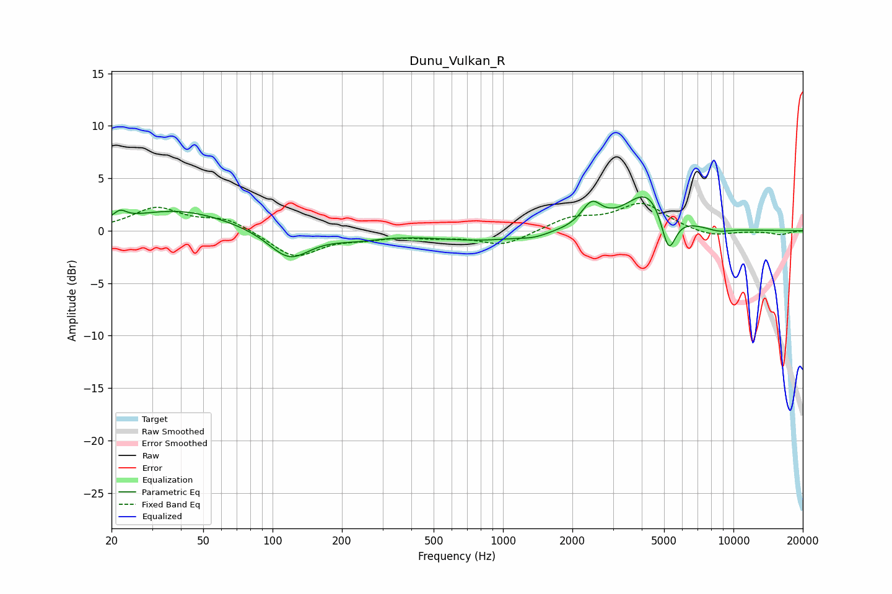

# Dunu_Vulkan_R
See [usage instructions](https://github.com/jaakkopasanen/AutoEq#usage) for more options and info.

### Parametric EQs
Apply preamp of -3.3 dB when using parametric equalizer.

|   # | Type    |   Fc (Hz) |    Q |   Gain (dB) |
|-----|---------|-----------|------|-------------|
|   1 | Peaking |        22 | 5.28 |         0.8 |
|   2 | Peaking |        39 | 0.63 |         2   |
|   3 | Peaking |       118 | 1.57 |        -2.8 |
|   4 | Peaking |       230 | 1.22 |        -0.6 |
|   5 | Peaking |       806 | 0.68 |        -0.9 |
|   6 | Peaking |      1366 | 2.41 |        -0.3 |
|   7 | Peaking |      2426 | 3.28 |         2.2 |
|   8 | Peaking |      4261 | 1.47 |         3.9 |
|   9 | Peaking |      5230 | 4.32 |        -4.1 |
|  10 | Peaking |      8614 | 2.38 |        -0.4 |

### Fixed Band EQs
When using fixed band (also called graphic) equalizer, apply preamp of **-2.7 dB** (if available) and set gains manually with these parameters.

|   # | Type    |   Fc (Hz) |    Q |   Gain (dB) |
|-----|---------|-----------|------|-------------|
|   1 | Peaking |        31 | 1.41 |         2.1 |
|   2 | Peaking |        62 | 1.41 |         1.1 |
|   3 | Peaking |       125 | 1.41 |        -2.5 |
|   4 | Peaking |       250 | 1.41 |        -0.5 |
|   5 | Peaking |       500 | 1.41 |        -0.5 |
|   6 | Peaking |      1000 | 1.41 |        -1.4 |
|   7 | Peaking |      2000 | 1.41 |         1.2 |
|   8 | Peaking |      4000 | 1.41 |         2.5 |
|   9 | Peaking |      8000 | 1.41 |        -0.6 |
|  10 | Peaking |     16000 | 1.41 |        -0.4 |

### Graphs

