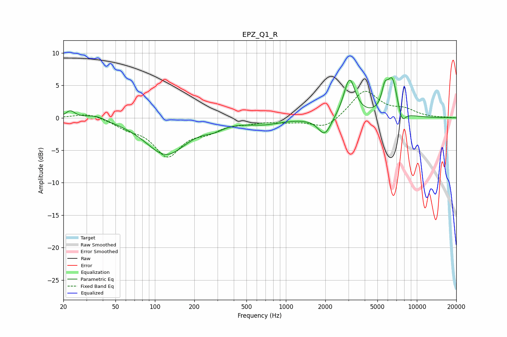

# EPZ_Q1_R
See [usage instructions](https://github.com/jaakkopasanen/AutoEq#usage) for more options and info.

### Parametric EQs
Apply preamp of -6.3 dB when using parametric equalizer.

|   # | Type    |   Fc (Hz) |    Q |   Gain (dB) |
|-----|---------|-----------|------|-------------|
|   1 | Peaking |        23 | 4.06 |         1.1 |
|   2 | Peaking |        35 | 1.87 |         0.8 |
|   3 | Peaking |       122 | 0.91 |        -5.6 |
|   4 | Peaking |       283 | 1.98 |        -0.8 |
|   5 | Peaking |       678 | 1.06 |        -0.8 |
|   6 | Peaking |      1981 | 2.83 |        -2.9 |
|   7 | Peaking |      3060 | 3.19 |         6   |
|   8 | Peaking |      5682 | 6    |         2.6 |
|   9 | Peaking |      6486 | 3.35 |         5.8 |
|  10 | Peaking |      7678 | 4.65 |        -2.2 |

### Fixed Band EQs
When using fixed band (also called graphic) equalizer, apply preamp of **-4.2 dB** (if available) and set gains manually with these parameters.

|   # | Type    |   Fc (Hz) |    Q |   Gain (dB) |
|-----|---------|-----------|------|-------------|
|   1 | Peaking |        31 | 1.41 |         0.8 |
|   2 | Peaking |        62 | 1.41 |        -1.2 |
|   3 | Peaking |       125 | 1.41 |        -5.6 |
|   4 | Peaking |       250 | 1.41 |        -1.6 |
|   5 | Peaking |       500 | 1.41 |        -0.5 |
|   6 | Peaking |      1000 | 1.41 |        -0.5 |
|   7 | Peaking |      2000 | 1.41 |        -1.7 |
|   8 | Peaking |      4000 | 1.41 |         4.2 |
|   9 | Peaking |      8000 | 1.41 |         1.1 |
|  10 | Peaking |     16000 | 1.41 |         0.1 |

### Graphs

