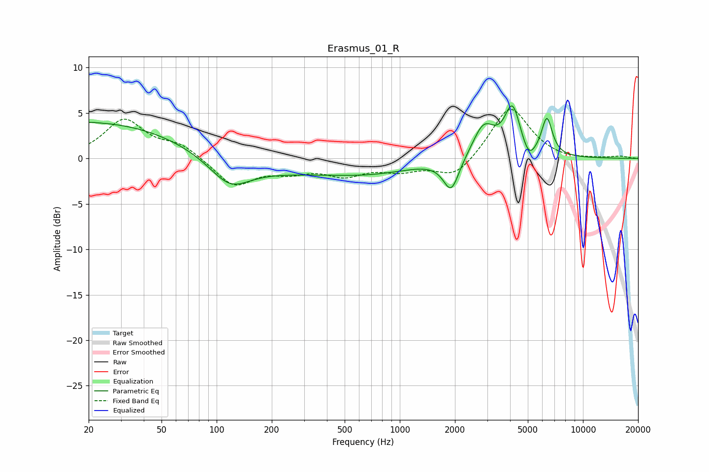

# Erasmus_01_R
See [usage instructions](https://github.com/jaakkopasanen/AutoEq#usage) for more options and info.

### Parametric EQs
Apply preamp of -5.9 dB when using parametric equalizer.

|   # | Type    |   Fc (Hz) |    Q |   Gain (dB) |
|-----|---------|-----------|------|-------------|
|   1 | Peaking |        21 | 4.59 |         0.1 |
|   2 | Peaking |        25 | 0.26 |         4.2 |
|   3 | Peaking |       118 | 1.3  |        -2.8 |
|   4 | Peaking |       172 | 0.3  |        -1.7 |
|   5 | Peaking |       743 | 0.61 |        -1.1 |
|   6 | Peaking |      1909 | 3.29 |        -3.6 |
|   7 | Peaking |      2870 | 2.34 |         3.6 |
|   8 | Peaking |      4123 | 3.22 |         5.3 |
|   9 | Peaking |      5061 | 3.99 |        -1.7 |
|  10 | Peaking |      6355 | 4.67 |         4.1 |

### Fixed Band EQs
When using fixed band (also called graphic) equalizer, apply preamp of **-5.5 dB** (if available) and set gains manually with these parameters.

|   # | Type    |   Fc (Hz) |    Q |   Gain (dB) |
|-----|---------|-----------|------|-------------|
|   1 | Peaking |        31 | 1.41 |         4.2 |
|   2 | Peaking |        62 | 1.41 |         1.4 |
|   3 | Peaking |       125 | 1.41 |        -3   |
|   4 | Peaking |       250 | 1.41 |        -1.2 |
|   5 | Peaking |       500 | 1.41 |        -1.6 |
|   6 | Peaking |      1000 | 1.41 |        -1.1 |
|   7 | Peaking |      2000 | 1.41 |        -2.2 |
|   8 | Peaking |      4000 | 1.41 |         5.8 |
|   9 | Peaking |      8000 | 1.41 |        -0.3 |
|  10 | Peaking |     16000 | 1.41 |         0.2 |

### Graphs

