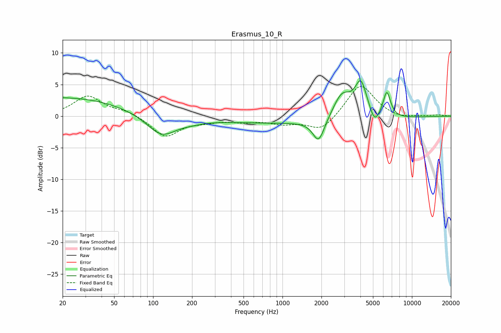

# Erasmus_10_R
See [usage instructions](https://github.com/jaakkopasanen/AutoEq#usage) for more options and info.

### Parametric EQs
Apply preamp of -5.7 dB when using parametric equalizer.

|   # | Type    |   Fc (Hz) |    Q |   Gain (dB) |
|-----|---------|-----------|------|-------------|
|   1 | Peaking |        20 | 5.22 |         0.1 |
|   2 | Peaking |        23 | 0.34 |         2.9 |
|   3 | Peaking |       116 | 1.24 |        -3.3 |
|   4 | Peaking |       199 | 1.49 |        -0.4 |
|   5 | Peaking |      1441 | 0.18 |        -1.2 |
|   6 | Peaking |      1903 | 3.17 |        -3.6 |
|   7 | Peaking |      2880 | 2.03 |         4   |
|   8 | Peaking |      4033 | 2.96 |         5.5 |
|   9 | Peaking |      5143 | 4.07 |        -2   |
|  10 | Peaking |      6398 | 4.75 |         4.1 |

### Fixed Band EQs
When using fixed band (also called graphic) equalizer, apply preamp of **-4.8 dB** (if available) and set gains manually with these parameters.

|   # | Type    |   Fc (Hz) |    Q |   Gain (dB) |
|-----|---------|-----------|------|-------------|
|   1 | Peaking |        31 | 1.41 |         3.1 |
|   2 | Peaking |        62 | 1.41 |         0.8 |
|   3 | Peaking |       125 | 1.41 |        -3.3 |
|   4 | Peaking |       250 | 1.41 |        -0.6 |
|   5 | Peaking |       500 | 1.41 |        -0.7 |
|   6 | Peaking |      1000 | 1.41 |        -1   |
|   7 | Peaking |      2000 | 1.41 |        -2.4 |
|   8 | Peaking |      4000 | 1.41 |         5.2 |
|   9 | Peaking |      8000 | 1.41 |        -0.5 |
|  10 | Peaking |     16000 | 1.41 |         0.2 |

### Graphs

