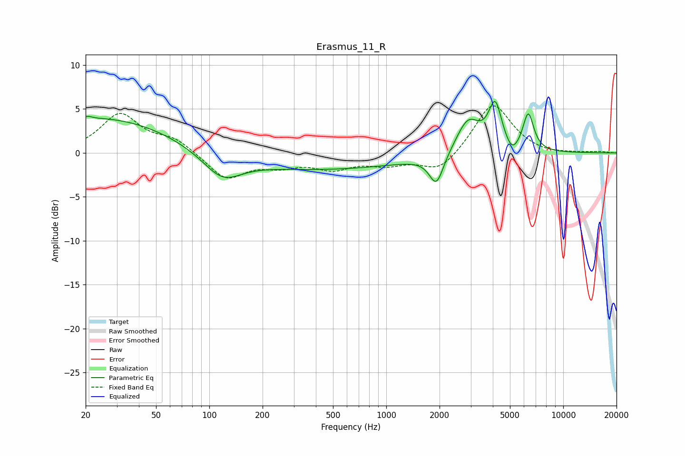

# Erasmus_11_R
See [usage instructions](https://github.com/jaakkopasanen/AutoEq#usage) for more options and info.

### Parametric EQs
Apply preamp of -6.0 dB when using parametric equalizer.

|   # | Type    |   Fc (Hz) |    Q |   Gain (dB) |
|-----|---------|-----------|------|-------------|
|   1 | Peaking |        21 | 5.89 |         0.3 |
|   2 | Peaking |        25 | 0.34 |         4.1 |
|   3 | Peaking |       118 | 1.32 |        -2.8 |
|   4 | Peaking |       287 | 0.27 |        -1.2 |
|   5 | Peaking |       751 | 0.25 |        -0.8 |
|   6 | Peaking |      1921 | 3.55 |        -3.4 |
|   7 | Peaking |      2898 | 2.07 |         4   |
|   8 | Peaking |      4127 | 3.69 |         5.2 |
|   9 | Peaking |      5134 | 3.86 |        -1.4 |
|  10 | Peaking |      6346 | 4.48 |         4.3 |

### Fixed Band EQs
When using fixed band (also called graphic) equalizer, apply preamp of **-5.4 dB** (if available) and set gains manually with these parameters.

|   # | Type    |   Fc (Hz) |    Q |   Gain (dB) |
|-----|---------|-----------|------|-------------|
|   1 | Peaking |        31 | 1.41 |         4.3 |
|   2 | Peaking |        62 | 1.41 |         1.5 |
|   3 | Peaking |       125 | 1.41 |        -3   |
|   4 | Peaking |       250 | 1.41 |        -1.2 |
|   5 | Peaking |       500 | 1.41 |        -1.6 |
|   6 | Peaking |      1000 | 1.41 |        -1.1 |
|   7 | Peaking |      2000 | 1.41 |        -2.2 |
|   8 | Peaking |      4000 | 1.41 |         5.8 |
|   9 | Peaking |      8000 | 1.41 |        -0.2 |
|  10 | Peaking |     16000 | 1.41 |         0.1 |

### Graphs

