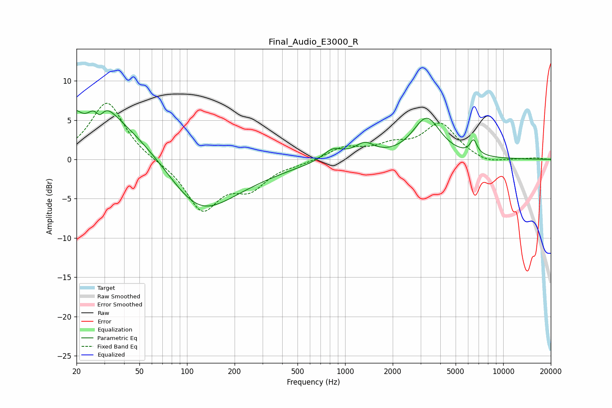

# Final_Audio_E3000_R
See [usage instructions](https://github.com/jaakkopasanen/AutoEq#usage) for more options and info.

### Parametric EQs
Apply preamp of -6.4 dB when using parametric equalizer.

|   # | Type    |   Fc (Hz) |    Q |   Gain (dB) |
|-----|---------|-----------|------|-------------|
|   1 | Peaking |        23 | 2.72 |        -2   |
|   2 | Peaking |        27 | 1.83 |         2.9 |
|   3 | Peaking |        28 | 5.07 |        -1.9 |
|   4 | Peaking |        28 | 0.19 |         7.9 |
|   5 | Peaking |       117 | 0.53 |       -10.8 |
|   6 | Peaking |       836 | 2.25 |         1.5 |
|   7 | Peaking |      1337 | 2.21 |         1.8 |
|   8 | Peaking |      1456 | 2.32 |        -0.1 |
|   9 | Peaking |      3279 | 1.61 |         5.2 |
|  10 | Peaking |      6496 | 6    |         1.8 |

### Fixed Band EQs
When using fixed band (also called graphic) equalizer, apply preamp of **-7.2 dB** (if available) and set gains manually with these parameters.

|   # | Type    |   Fc (Hz) |    Q |   Gain (dB) |
|-----|---------|-----------|------|-------------|
|   1 | Peaking |        31 | 1.41 |         7.4 |
|   2 | Peaking |        62 | 1.41 |        -0.2 |
|   3 | Peaking |       125 | 1.41 |        -6.3 |
|   4 | Peaking |       250 | 1.41 |        -3.2 |
|   5 | Peaking |       500 | 1.41 |        -0.4 |
|   6 | Peaking |      1000 | 1.41 |         1.5 |
|   7 | Peaking |      2000 | 1.41 |         1.5 |
|   8 | Peaking |      4000 | 1.41 |         4.4 |
|   9 | Peaking |      8000 | 1.41 |        -0.7 |
|  10 | Peaking |     16000 | 1.41 |         0.2 |

### Graphs

