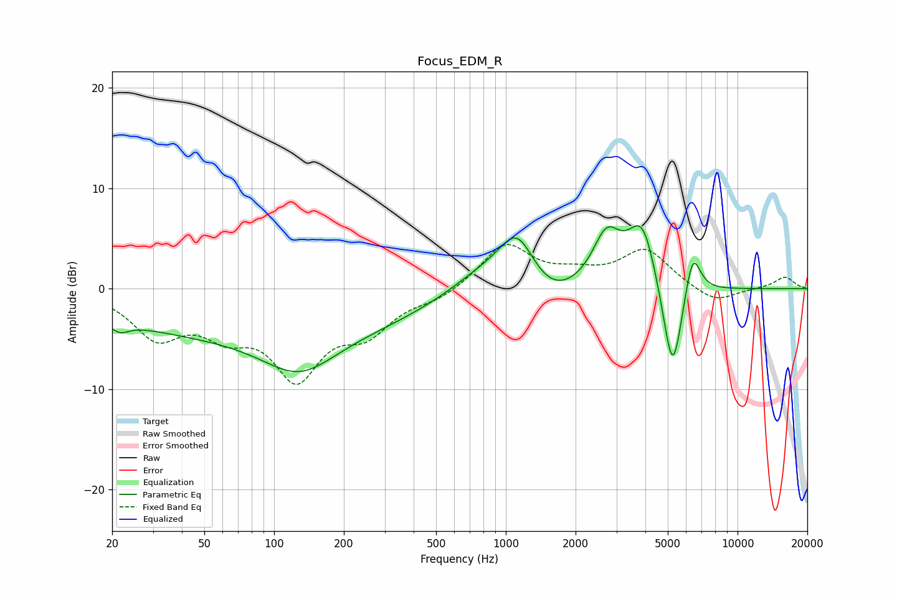

# Focus_EDM_R
See [usage instructions](https://github.com/jaakkopasanen/AutoEq#usage) for more options and info.

### Parametric EQs
Apply preamp of -6.4 dB when using parametric equalizer.

|   # | Type    |   Fc (Hz) |    Q |   Gain (dB) |
|-----|---------|-----------|------|-------------|
|   1 | Peaking |        21 | 3.39 |        -1.1 |
|   2 | Peaking |        87 | 0.18 |        -4.7 |
|   3 | Peaking |       128 | 0.92 |        -3.8 |
|   4 | Peaking |       800 | 0.9  |         2.3 |
|   5 | Peaking |      1122 | 1.77 |         5.5 |
|   6 | Peaking |      1515 | 1.13 |        -2.4 |
|   7 | Peaking |      2718 | 2.32 |         4.9 |
|   8 | Peaking |      3891 | 2.16 |         6.9 |
|   9 | Peaking |      5243 | 3.04 |       -10.6 |
|  10 | Peaking |      6389 | 3.87 |         5   |

### Fixed Band EQs
When using fixed band (also called graphic) equalizer, apply preamp of **-4.5 dB** (if available) and set gains manually with these parameters.

|   # | Type    |   Fc (Hz) |    Q |   Gain (dB) |
|-----|---------|-----------|------|-------------|
|   1 | Peaking |        31 | 1.41 |        -4.4 |
|   2 | Peaking |        62 | 1.41 |        -3.3 |
|   3 | Peaking |       125 | 1.41 |        -8.1 |
|   4 | Peaking |       250 | 1.41 |        -3.6 |
|   5 | Peaking |       500 | 1.41 |        -0.9 |
|   6 | Peaking |      1000 | 1.41 |         4.4 |
|   7 | Peaking |      2000 | 1.41 |         1.1 |
|   8 | Peaking |      4000 | 1.41 |         3.8 |
|   9 | Peaking |      8000 | 1.41 |        -1.5 |
|  10 | Peaking |     16000 | 1.41 |         1.2 |

### Graphs

