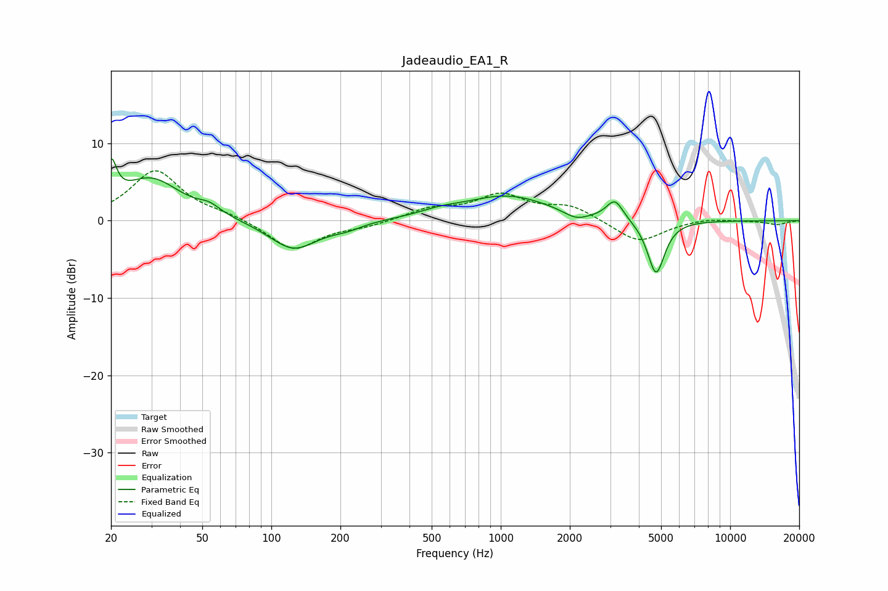

# Jadeaudio_EA1_R
See [usage instructions](https://github.com/jaakkopasanen/AutoEq#usage) for more options and info.

### Parametric EQs
Apply preamp of -8.1 dB when using parametric equalizer.

|   # | Type    |   Fc (Hz) |    Q |   Gain (dB) |
|-----|---------|-----------|------|-------------|
|   1 | Peaking |        20 | 6    |         5.1 |
|   2 | Peaking |        30 | 1.08 |         5.4 |
|   3 | Peaking |        54 | 2.97 |         1   |
|   4 | Peaking |       125 | 1.33 |        -3.9 |
|   5 | Peaking |       213 | 2.12 |        -0.7 |
|   6 | Peaking |       540 | 1.63 |         0.6 |
|   7 | Peaking |      1065 | 0.74 |         3.2 |
|   8 | Peaking |      2130 | 2.59 |        -1.1 |
|   9 | Peaking |      3145 | 3.9  |         2.6 |
|  10 | Peaking |      4754 | 3.73 |        -7.1 |

### Fixed Band EQs
When using fixed band (also called graphic) equalizer, apply preamp of **-6.5 dB** (if available) and set gains manually with these parameters.

|   # | Type    |   Fc (Hz) |    Q |   Gain (dB) |
|-----|---------|-----------|------|-------------|
|   1 | Peaking |        31 | 1.41 |         6.5 |
|   2 | Peaking |        62 | 1.41 |         0.6 |
|   3 | Peaking |       125 | 1.41 |        -3.9 |
|   4 | Peaking |       250 | 1.41 |        -0.7 |
|   5 | Peaking |       500 | 1.41 |         1.4 |
|   6 | Peaking |      1000 | 1.41 |         3.1 |
|   7 | Peaking |      2000 | 1.41 |         1.8 |
|   8 | Peaking |      4000 | 1.41 |        -2.9 |
|   9 | Peaking |      8000 | 1.41 |         0.4 |
|  10 | Peaking |     16000 | 1.41 |        -0.5 |

### Graphs

