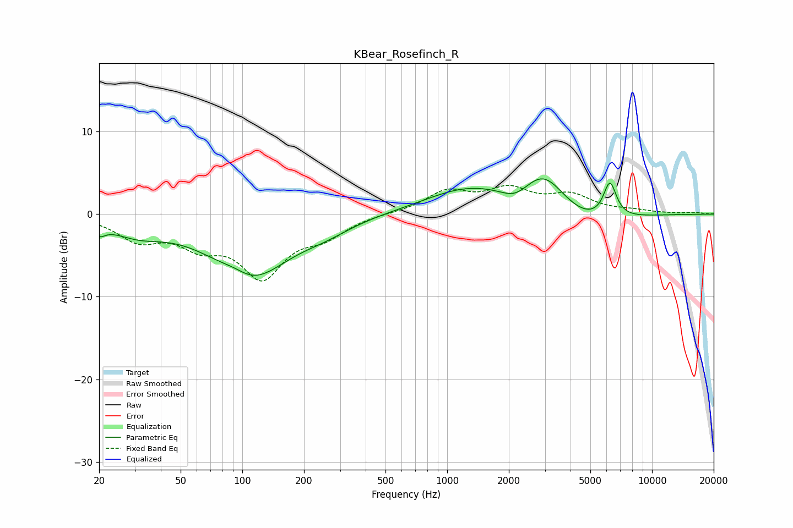

# KBear_Rosefinch_R
See [usage instructions](https://github.com/jaakkopasanen/AutoEq#usage) for more options and info.

### Parametric EQs
Apply preamp of -4.4 dB when using parametric equalizer.

|   # | Type    |   Fc (Hz) |    Q |   Gain (dB) |
|-----|---------|-----------|------|-------------|
|   1 | Peaking |        20 | 4.82 |        -1.2 |
|   2 | Peaking |        30 | 1.06 |        -1.9 |
|   3 | Peaking |        92 | 1.92 |         1   |
|   4 | Peaking |       108 | 0.75 |        -7.8 |
|   5 | Peaking |       256 | 1.11 |        -1.1 |
|   6 | Peaking |      1271 | 0.66 |         3   |
|   7 | Peaking |      2155 | 2.04 |        -1.4 |
|   8 | Peaking |      2963 | 1.32 |         4.6 |
|   9 | Peaking |      4805 | 0.83 |        -1.9 |
|  10 | Peaking |      6229 | 4.3  |         4.4 |

### Fixed Band EQs
When using fixed band (also called graphic) equalizer, apply preamp of **-3.6 dB** (if available) and set gains manually with these parameters.

|   # | Type    |   Fc (Hz) |    Q |   Gain (dB) |
|-----|---------|-----------|------|-------------|
|   1 | Peaking |        31 | 1.41 |        -2.8 |
|   2 | Peaking |        62 | 1.41 |        -3   |
|   3 | Peaking |       125 | 1.41 |        -7.1 |
|   4 | Peaking |       250 | 1.41 |        -2.2 |
|   5 | Peaking |       500 | 1.41 |         0.1 |
|   6 | Peaking |      1000 | 1.41 |         2.6 |
|   7 | Peaking |      2000 | 1.41 |         2.7 |
|   8 | Peaking |      4000 | 1.41 |         2.1 |
|   9 | Peaking |      8000 | 1.41 |         0.3 |
|  10 | Peaking |     16000 | 1.41 |         0.2 |

### Graphs

