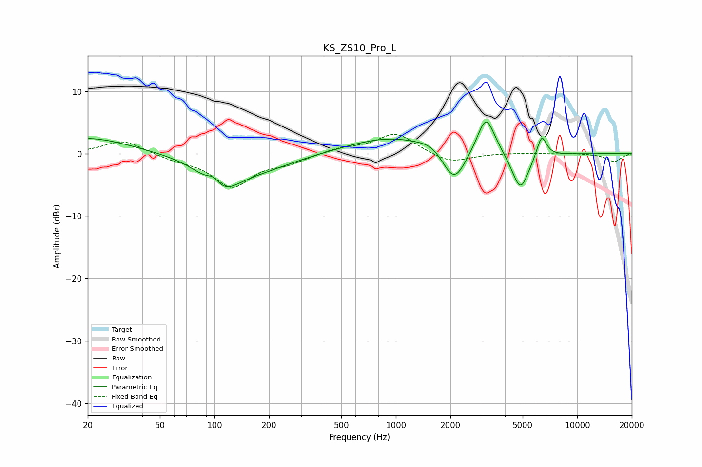

# KS_ZS10_Pro_L
See [usage instructions](https://github.com/jaakkopasanen/AutoEq#usage) for more options and info.

### Parametric EQs
Apply preamp of -5.2 dB when using parametric equalizer.

|   # | Type    |   Fc (Hz) |    Q |   Gain (dB) |
|-----|---------|-----------|------|-------------|
|   1 | Peaking |        20 | 0.61 |         2.6 |
|   2 | Peaking |        99 | 3.87 |         1.7 |
|   3 | Peaking |       108 | 1.37 |        -5   |
|   4 | Peaking |       179 | 0.71 |        -2.1 |
|   5 | Peaking |       938 | 0.6  |         2.7 |
|   6 | Peaking |      1583 | 2.08 |         1   |
|   7 | Peaking |      2095 | 2.14 |        -5.8 |
|   8 | Peaking |      3142 | 2.87 |         6.4 |
|   9 | Peaking |      4863 | 2.94 |        -6.2 |
|  10 | Peaking |      6364 | 5    |         3.6 |

### Fixed Band EQs
When using fixed band (also called graphic) equalizer, apply preamp of **-3.2 dB** (if available) and set gains manually with these parameters.

|   # | Type    |   Fc (Hz) |    Q |   Gain (dB) |
|-----|---------|-----------|------|-------------|
|   1 | Peaking |        31 | 1.41 |         2.2 |
|   2 | Peaking |        62 | 1.41 |        -0.8 |
|   3 | Peaking |       125 | 1.41 |        -5.2 |
|   4 | Peaking |       250 | 1.41 |        -1.2 |
|   5 | Peaking |       500 | 1.41 |         0.8 |
|   6 | Peaking |      1000 | 1.41 |         3.3 |
|   7 | Peaking |      2000 | 1.41 |        -1.6 |
|   8 | Peaking |      4000 | 1.41 |         0.1 |
|   9 | Peaking |      8000 | 1.41 |         0.2 |
|  10 | Peaking |     16000 | 1.41 |        -1.3 |

### Graphs

