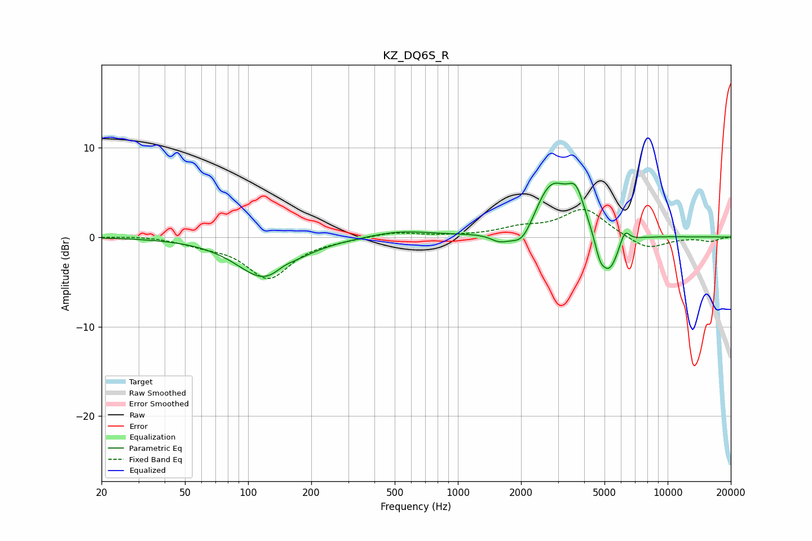

# KZ_DQ6S_R
See [usage instructions](https://github.com/jaakkopasanen/AutoEq#usage) for more options and info.

### Parametric EQs
Apply preamp of -6.1 dB when using parametric equalizer.

|   # | Type    |   Fc (Hz) |    Q |   Gain (dB) |
|-----|---------|-----------|------|-------------|
|   1 | Peaking |       121 | 1.06 |        -4.7 |
|   2 | Peaking |       148 | 2.84 |         0.6 |
|   3 | Peaking |       529 | 0.98 |         0.7 |
|   4 | Peaking |      1580 | 3.16 |        -0.9 |
|   5 | Peaking |      2035 | 2.49 |        -2.7 |
|   6 | Peaking |      2782 | 1.61 |         6.2 |
|   7 | Peaking |      3663 | 3.41 |         3.5 |
|   8 | Peaking |      4748 | 6    |        -1.6 |
|   9 | Peaking |      5258 | 2.96 |        -4.5 |
|  10 | Peaking |      6244 | 6    |         1.7 |

### Fixed Band EQs
When using fixed band (also called graphic) equalizer, apply preamp of **-3.2 dB** (if available) and set gains manually with these parameters.

|   # | Type    |   Fc (Hz) |    Q |   Gain (dB) |
|-----|---------|-----------|------|-------------|
|   1 | Peaking |        31 | 1.41 |         0.2 |
|   2 | Peaking |        62 | 1.41 |        -0.7 |
|   3 | Peaking |       125 | 1.41 |        -4.5 |
|   4 | Peaking |       250 | 1.41 |        -0.2 |
|   5 | Peaking |       500 | 1.41 |         0.6 |
|   6 | Peaking |      1000 | 1.41 |         0.1 |
|   7 | Peaking |      2000 | 1.41 |         0.9 |
|   8 | Peaking |      4000 | 1.41 |         3.1 |
|   9 | Peaking |      8000 | 1.41 |        -1.5 |
|  10 | Peaking |     16000 | 1.41 |        -0.5 |

### Graphs

