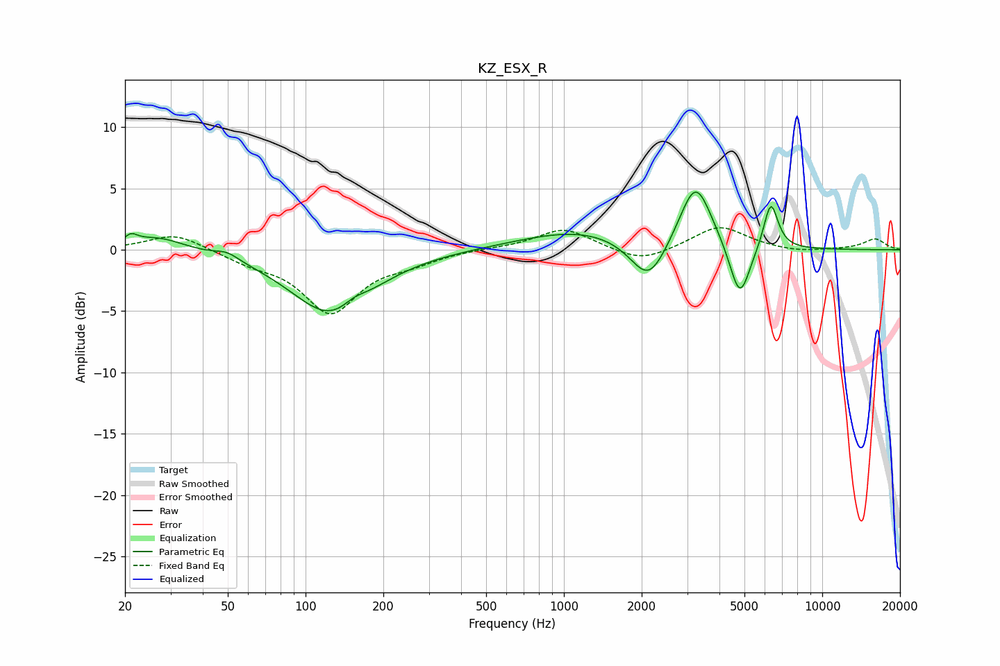

# KZ_ESX_R
See [usage instructions](https://github.com/jaakkopasanen/AutoEq#usage) for more options and info.

### Parametric EQs
Apply preamp of -4.8 dB when using parametric equalizer.

|   # | Type    |   Fc (Hz) |    Q |   Gain (dB) |
|-----|---------|-----------|------|-------------|
|   1 | Peaking |        21 | 5.83 |         0.7 |
|   2 | Peaking |        27 | 1.32 |         1.2 |
|   3 | Peaking |        50 | 3.01 |         0.6 |
|   4 | Peaking |       126 | 0.9  |        -5.3 |
|   5 | Peaking |       154 | 3.04 |         0.7 |
|   6 | Peaking |      1157 | 0.62 |         1.6 |
|   7 | Peaking |      2129 | 2    |        -3.7 |
|   8 | Peaking |      3235 | 2.25 |         5.6 |
|   9 | Peaking |      4798 | 3.49 |        -4.7 |
|  10 | Peaking |      6322 | 4.89 |         3.9 |

### Fixed Band EQs
When using fixed band (also called graphic) equalizer, apply preamp of **-1.9 dB** (if available) and set gains manually with these parameters.

|   # | Type    |   Fc (Hz) |    Q |   Gain (dB) |
|-----|---------|-----------|------|-------------|
|   1 | Peaking |        31 | 1.41 |         1.4 |
|   2 | Peaking |        62 | 1.41 |        -0.8 |
|   3 | Peaking |       125 | 1.41 |        -5   |
|   4 | Peaking |       250 | 1.41 |        -0.8 |
|   5 | Peaking |       500 | 1.41 |         0.1 |
|   6 | Peaking |      1000 | 1.41 |         1.8 |
|   7 | Peaking |      2000 | 1.41 |        -1.1 |
|   8 | Peaking |      4000 | 1.41 |         2   |
|   9 | Peaking |      8000 | 1.41 |        -0.3 |
|  10 | Peaking |     16000 | 1.41 |         0.9 |

### Graphs

