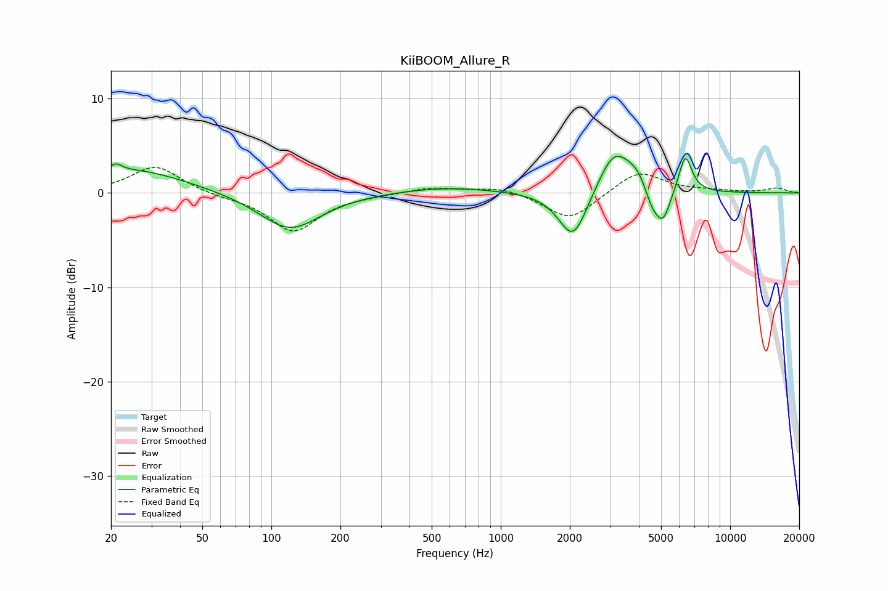

# KiiBOOM_Allure_R
See [usage instructions](https://github.com/jaakkopasanen/AutoEq#usage) for more options and info.

### Parametric EQs
Apply preamp of -4.0 dB when using parametric equalizer.

|   # | Type    |   Fc (Hz) |    Q |   Gain (dB) |
|-----|---------|-----------|------|-------------|
|   1 | Peaking |        21 | 5.77 |         0.7 |
|   2 | Peaking |        24 | 0.59 |         2.5 |
|   3 | Peaking |       120 | 1.06 |        -4   |
|   4 | Peaking |       574 | 0.67 |         0.6 |
|   5 | Peaking |      2067 | 2.25 |        -5.3 |
|   6 | Peaking |      3101 | 2.06 |         4.3 |
|   7 | Peaking |      3958 | 2.34 |         2   |
|   8 | Peaking |      4556 | 3.96 |        -2.3 |
|   9 | Peaking |      5099 | 4.07 |        -3.3 |
|  10 | Peaking |      6374 | 4.78 |         4   |

### Fixed Band EQs
When using fixed band (also called graphic) equalizer, apply preamp of **-2.8 dB** (if available) and set gains manually with these parameters.

|   # | Type    |   Fc (Hz) |    Q |   Gain (dB) |
|-----|---------|-----------|------|-------------|
|   1 | Peaking |        31 | 1.41 |         2.9 |
|   2 | Peaking |        62 | 1.41 |        -0.3 |
|   3 | Peaking |       125 | 1.41 |        -4.1 |
|   4 | Peaking |       250 | 1.41 |        -0.2 |
|   5 | Peaking |       500 | 1.41 |         0.6 |
|   6 | Peaking |      1000 | 1.41 |         0.7 |
|   7 | Peaking |      2000 | 1.41 |        -3   |
|   8 | Peaking |      4000 | 1.41 |         2.4 |
|   9 | Peaking |      8000 | 1.41 |         0.2 |
|  10 | Peaking |     16000 | 1.41 |         0.5 |

### Graphs

