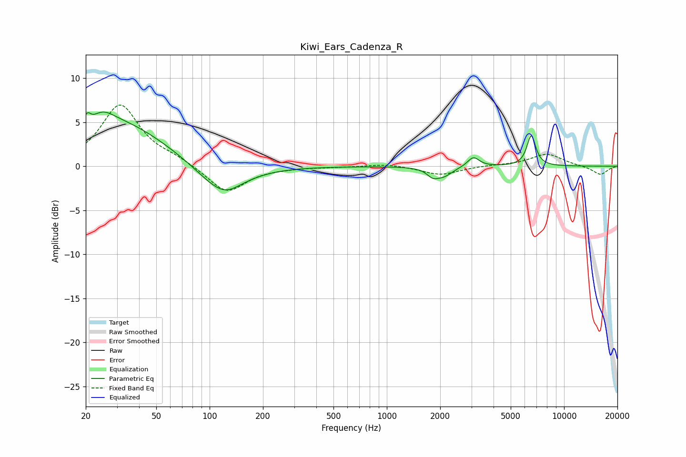

# Kiwi_Ears_Cadenza_R
See [usage instructions](https://github.com/jaakkopasanen/AutoEq#usage) for more options and info.

### Parametric EQs
Apply preamp of -6.3 dB when using parametric equalizer.

|   # | Type    |   Fc (Hz) |    Q |   Gain (dB) |
|-----|---------|-----------|------|-------------|
|   1 | Peaking |        21 | 5.59 |         3.4 |
|   2 | Peaking |        21 | 5.55 |        -2.3 |
|   3 | Peaking |        25 | 2.24 |         1.4 |
|   4 | Peaking |        30 | 0.53 |         5   |
|   5 | Peaking |       115 | 1    |        -3.1 |
|   6 | Peaking |       123 | 1.93 |        -0.7 |
|   7 | Peaking |      1814 | 4.36 |        -0.8 |
|   8 | Peaking |      2094 | 2.78 |        -1   |
|   9 | Peaking |      3079 | 4.33 |         1.1 |
|  10 | Peaking |      6533 | 5.57 |         3.5 |

### Fixed Band EQs
When using fixed band (also called graphic) equalizer, apply preamp of **-7.0 dB** (if available) and set gains manually with these parameters.

|   # | Type    |   Fc (Hz) |    Q |   Gain (dB) |
|-----|---------|-----------|------|-------------|
|   1 | Peaking |        31 | 1.41 |         6.9 |
|   2 | Peaking |        62 | 1.41 |         0.7 |
|   3 | Peaking |       125 | 1.41 |        -3.1 |
|   4 | Peaking |       250 | 1.41 |        -0.1 |
|   5 | Peaking |       500 | 1.41 |        -0.1 |
|   6 | Peaking |      1000 | 1.41 |         0.3 |
|   7 | Peaking |      2000 | 1.41 |        -1   |
|   8 | Peaking |      4000 | 1.41 |         0.1 |
|   9 | Peaking |      8000 | 1.41 |         1.4 |
|  10 | Peaking |     16000 | 1.41 |        -1   |

### Graphs

