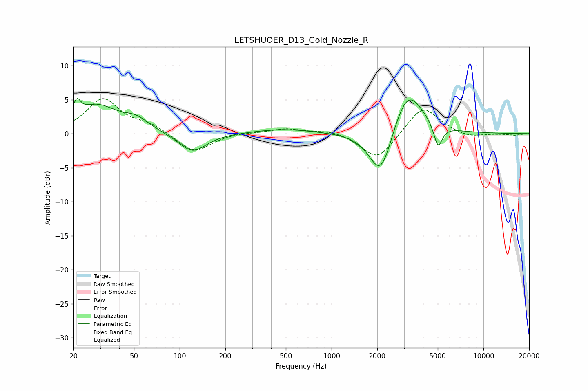

# LETSHUOER_D13_Gold_Nozzle_R
See [usage instructions](https://github.com/jaakkopasanen/AutoEq#usage) for more options and info.

### Parametric EQs
Apply preamp of -5.3 dB when using parametric equalizer.

|   # | Type    |   Fc (Hz) |    Q |   Gain (dB) |
|-----|---------|-----------|------|-------------|
|   1 | Peaking |        21 | 5.9  |         2.2 |
|   2 | Peaking |        28 | 1.03 |         4   |
|   3 | Peaking |        52 | 1.67 |         1.5 |
|   4 | Peaking |       121 | 1.56 |        -2.9 |
|   5 | Peaking |       482 | 0.73 |         0.7 |
|   6 | Peaking |      2064 | 1.78 |        -1.3 |
|   7 | Peaking |      2122 | 1.86 |        -6.2 |
|   8 | Peaking |      3059 | 1.44 |         1.6 |
|   9 | Peaking |      3197 | 1.41 |         5.5 |
|  10 | Peaking |      5027 | 4.95 |        -3.5 |

### Fixed Band EQs
When using fixed band (also called graphic) equalizer, apply preamp of **-5.2 dB** (if available) and set gains manually with these parameters.

|   # | Type    |   Fc (Hz) |    Q |   Gain (dB) |
|-----|---------|-----------|------|-------------|
|   1 | Peaking |        31 | 1.41 |         5   |
|   2 | Peaking |        62 | 1.41 |         1.2 |
|   3 | Peaking |       125 | 1.41 |        -2.9 |
|   4 | Peaking |       250 | 1.41 |         0.2 |
|   5 | Peaking |       500 | 1.41 |         0.7 |
|   6 | Peaking |      1000 | 1.41 |         0.6 |
|   7 | Peaking |      2000 | 1.41 |        -4   |
|   8 | Peaking |      4000 | 1.41 |         4.2 |
|   9 | Peaking |      8000 | 1.41 |        -0.6 |
|  10 | Peaking |     16000 | 1.41 |        -0.2 |

### Graphs

