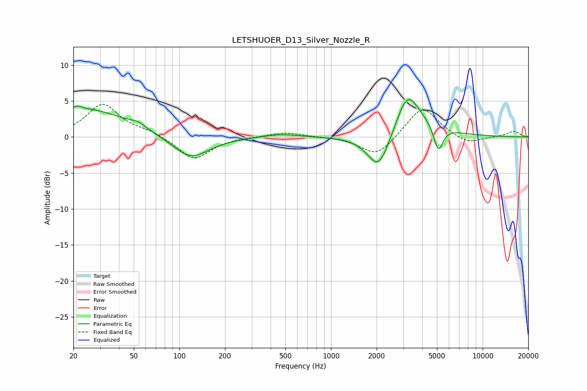

# LETSHUOER_D13_Silver_Nozzle_R
See [usage instructions](https://github.com/jaakkopasanen/AutoEq#usage) for more options and info.

### Parametric EQs
Apply preamp of -5.3 dB when using parametric equalizer.

|   # | Type    |   Fc (Hz) |    Q |   Gain (dB) |
|-----|---------|-----------|------|-------------|
|   1 | Peaking |        21 | 5.74 |         3   |
|   2 | Peaking |        21 | 5.84 |        -2.5 |
|   3 | Peaking |        24 | 0.5  |         3.9 |
|   4 | Peaking |        54 | 2.85 |         0.6 |
|   5 | Peaking |       119 | 1.15 |        -3.2 |
|   6 | Peaking |       468 | 1.27 |         0.5 |
|   7 | Peaking |      2062 | 1.9  |        -5.2 |
|   8 | Peaking |      3180 | 1.9  |         5.4 |
|   9 | Peaking |      4080 | 0.92 |         1.5 |
|  10 | Peaking |      5103 | 4.53 |        -3.7 |

### Fixed Band EQs
When using fixed band (also called graphic) equalizer, apply preamp of **-4.6 dB** (if available) and set gains manually with these parameters.

|   # | Type    |   Fc (Hz) |    Q |   Gain (dB) |
|-----|---------|-----------|------|-------------|
|   1 | Peaking |        31 | 1.41 |         4.5 |
|   2 | Peaking |        62 | 1.41 |         0.7 |
|   3 | Peaking |       125 | 1.41 |        -3.2 |
|   4 | Peaking |       250 | 1.41 |         0   |
|   5 | Peaking |       500 | 1.41 |         0.7 |
|   6 | Peaking |      1000 | 1.41 |         0.1 |
|   7 | Peaking |      2000 | 1.41 |        -2.8 |
|   8 | Peaking |      4000 | 1.41 |         4.3 |
|   9 | Peaking |      8000 | 1.41 |        -1.1 |
|  10 | Peaking |     16000 | 1.41 |         0.8 |

### Graphs

