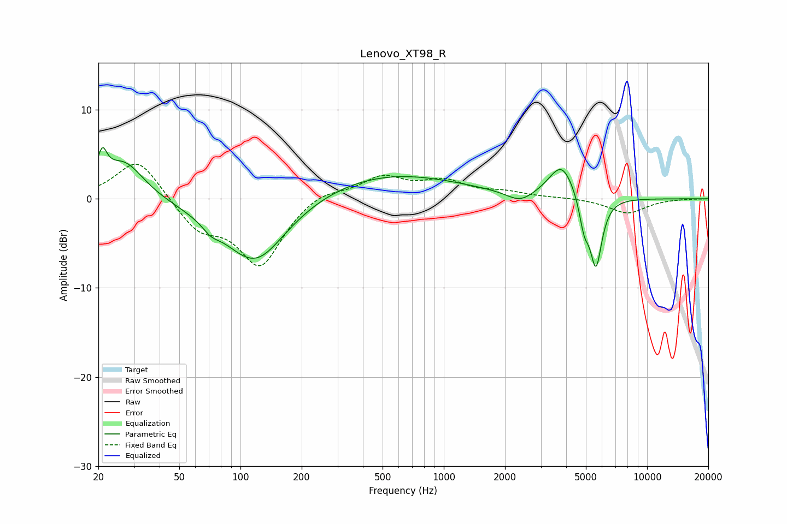

# Lenovo_XT98_R
See [usage instructions](https://github.com/jaakkopasanen/AutoEq#usage) for more options and info.

### Parametric EQs
Apply preamp of -5.8 dB when using parametric equalizer.

|   # | Type    |   Fc (Hz) |    Q |   Gain (dB) |
|-----|---------|-----------|------|-------------|
|   1 | Peaking |        21 | 5.99 |         3.2 |
|   2 | Peaking |        27 | 1.43 |         4.4 |
|   3 | Peaking |        71 | 3.55 |        -0.8 |
|   4 | Peaking |       116 | 0.86 |        -7   |
|   5 | Peaking |       126 | 1.52 |        -0.6 |
|   6 | Peaking |       519 | 0.39 |         2.9 |
|   7 | Peaking |      2373 | 2.15 |        -1.2 |
|   8 | Peaking |      3806 | 2.21 |         3.9 |
|   9 | Peaking |      4903 | 5.84 |        -3.1 |
|  10 | Peaking |      5604 | 4.66 |        -7.8 |

### Fixed Band EQs
When using fixed band (also called graphic) equalizer, apply preamp of **-4.0 dB** (if available) and set gains manually with these parameters.

|   # | Type    |   Fc (Hz) |    Q |   Gain (dB) |
|-----|---------|-----------|------|-------------|
|   1 | Peaking |        31 | 1.41 |         4.7 |
|   2 | Peaking |        62 | 1.41 |        -3.2 |
|   3 | Peaking |       125 | 1.41 |        -7.4 |
|   4 | Peaking |       250 | 1.41 |         1.1 |
|   5 | Peaking |       500 | 1.41 |         2.4 |
|   6 | Peaking |      1000 | 1.41 |         1.8 |
|   7 | Peaking |      2000 | 1.41 |         0.6 |
|   8 | Peaking |      4000 | 1.41 |         0.1 |
|   9 | Peaking |      8000 | 1.41 |        -1.6 |
|  10 | Peaking |     16000 | 1.41 |         0   |

### Graphs

