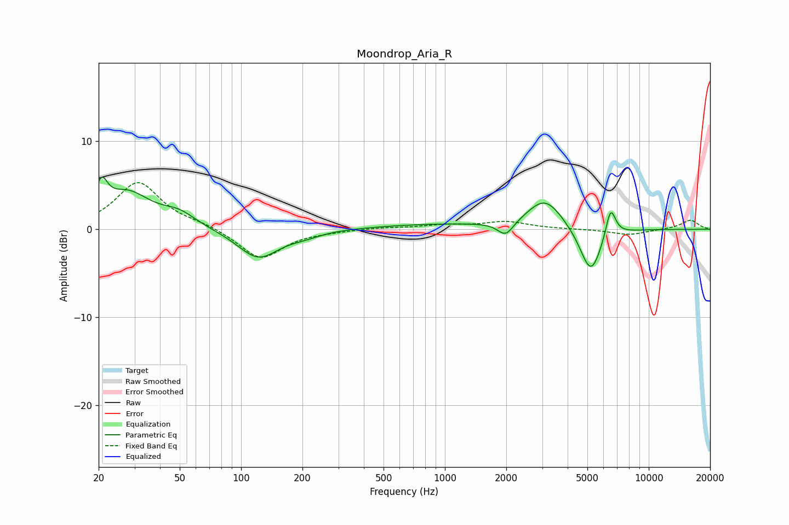

# Moondrop_Aria_R
See [usage instructions](https://github.com/jaakkopasanen/AutoEq#usage) for more options and info.

### Parametric EQs
Apply preamp of -6.0 dB when using parametric equalizer.

|   # | Type    |   Fc (Hz) |    Q |   Gain (dB) |
|-----|---------|-----------|------|-------------|
|   1 | Peaking |        21 | 4.92 |         3.2 |
|   2 | Peaking |        28 | 1.21 |         4   |
|   3 | Peaking |        50 | 1.7  |         1.4 |
|   4 | Peaking |       121 | 1.4  |        -3.4 |
|   5 | Peaking |       206 | 1.81 |        -0.5 |
|   6 | Peaking |       933 | 0.45 |         0.6 |
|   7 | Peaking |      1988 | 3.58 |        -1.7 |
|   8 | Peaking |      3103 | 1.62 |         3.5 |
|   9 | Peaking |      5198 | 2.59 |        -5.4 |
|  10 | Peaking |      6500 | 5.54 |         3.5 |

### Fixed Band EQs
When using fixed band (also called graphic) equalizer, apply preamp of **-5.4 dB** (if available) and set gains manually with these parameters.

|   # | Type    |   Fc (Hz) |    Q |   Gain (dB) |
|-----|---------|-----------|------|-------------|
|   1 | Peaking |        31 | 1.41 |         5.3 |
|   2 | Peaking |        62 | 1.41 |         0.5 |
|   3 | Peaking |       125 | 1.41 |        -3.4 |
|   4 | Peaking |       250 | 1.41 |        -0.2 |
|   5 | Peaking |       500 | 1.41 |         0.2 |
|   6 | Peaking |      1000 | 1.41 |         0.4 |
|   7 | Peaking |      2000 | 1.41 |         0.8 |
|   8 | Peaking |      4000 | 1.41 |         0   |
|   9 | Peaking |      8000 | 1.41 |        -0.6 |
|  10 | Peaking |     16000 | 1.41 |         1.1 |

### Graphs

