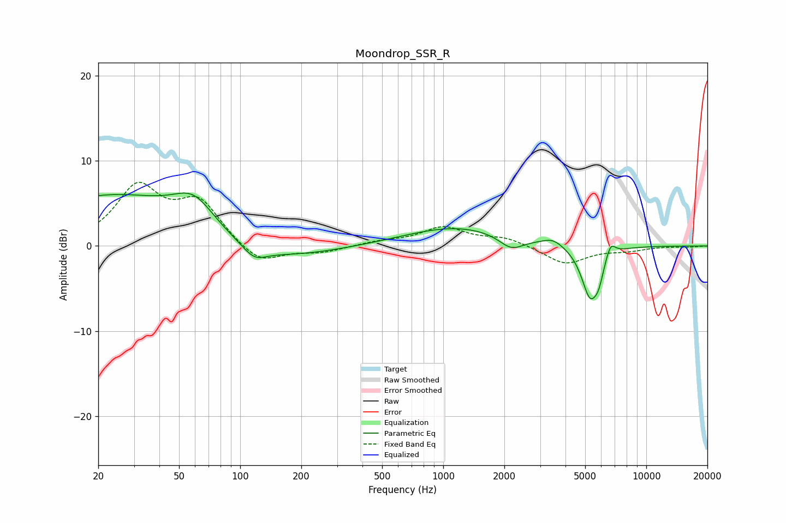

# Moondrop_SSR_R
See [usage instructions](https://github.com/jaakkopasanen/AutoEq#usage) for more options and info.

### Parametric EQs
Apply preamp of -6.3 dB when using parametric equalizer.

|   # | Type    |   Fc (Hz) |    Q |   Gain (dB) |
|-----|---------|-----------|------|-------------|
|   1 | Peaking |        24 | 0.36 |         6   |
|   2 | Peaking |        59 | 1.4  |         3.5 |
|   3 | Peaking |       117 | 2.43 |        -1.5 |
|   4 | Peaking |       129 | 0.48 |        -2.1 |
|   5 | Peaking |      1172 | 0.55 |         2.3 |
|   6 | Peaking |      2164 | 2.35 |        -1.6 |
|   7 | Peaking |      3472 | 2.88 |         0.8 |
|   8 | Peaking |      5301 | 3.16 |        -6   |
|   9 | Peaking |      5843 | 6    |        -1.7 |
|  10 | Peaking |      6669 | 5.7  |         1.7 |

### Fixed Band EQs
When using fixed band (also called graphic) equalizer, apply preamp of **-7.6 dB** (if available) and set gains manually with these parameters.

|   # | Type    |   Fc (Hz) |    Q |   Gain (dB) |
|-----|---------|-----------|------|-------------|
|   1 | Peaking |        31 | 1.41 |         6.6 |
|   2 | Peaking |        62 | 1.41 |         4.9 |
|   3 | Peaking |       125 | 1.41 |        -2.3 |
|   4 | Peaking |       250 | 1.41 |        -0.7 |
|   5 | Peaking |       500 | 1.41 |         0.5 |
|   6 | Peaking |      1000 | 1.41 |         2.1 |
|   7 | Peaking |      2000 | 1.41 |         0.9 |
|   8 | Peaking |      4000 | 1.41 |        -2.1 |
|   9 | Peaking |      8000 | 1.41 |        -0.5 |
|  10 | Peaking |     16000 | 1.41 |        -0.1 |

### Graphs

