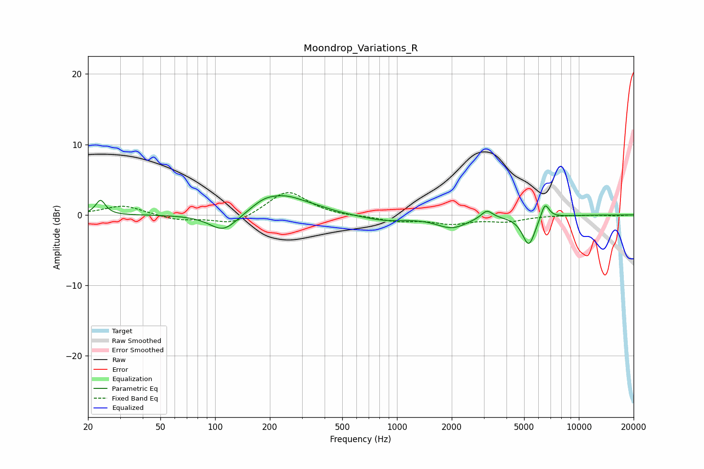

# Moondrop_Variations_R
See [usage instructions](https://github.com/jaakkopasanen/AutoEq#usage) for more options and info.

### Parametric EQs
Apply preamp of -2.8 dB when using parametric equalizer.

|   # | Type    |   Fc (Hz) |    Q |   Gain (dB) |
|-----|---------|-----------|------|-------------|
|   1 | Peaking |        23 | 5.42 |         2.1 |
|   2 | Peaking |       111 | 1.82 |        -2.6 |
|   3 | Peaking |       184 | 2.06 |         0.9 |
|   4 | Peaking |       242 | 1.12 |         2.5 |
|   5 | Peaking |       373 | 1.9  |         0.2 |
|   6 | Peaking |       854 | 1.09 |        -0.8 |
|   7 | Peaking |      2006 | 1.66 |        -1.7 |
|   8 | Peaking |      3120 | 4.49 |         1.2 |
|   9 | Peaking |      5307 | 3.91 |        -4.2 |
|  10 | Peaking |      6512 | 5.97 |         2.3 |

### Fixed Band EQs
When using fixed band (also called graphic) equalizer, apply preamp of **-3.3 dB** (if available) and set gains manually with these parameters.

|   # | Type    |   Fc (Hz) |    Q |   Gain (dB) |
|-----|---------|-----------|------|-------------|
|   1 | Peaking |        31 | 1.41 |         1.4 |
|   2 | Peaking |        62 | 1.41 |        -0.7 |
|   3 | Peaking |       125 | 1.41 |        -1.4 |
|   4 | Peaking |       250 | 1.41 |         3.5 |
|   5 | Peaking |       500 | 1.41 |        -0.2 |
|   6 | Peaking |      1000 | 1.41 |        -0.8 |
|   7 | Peaking |      2000 | 1.41 |        -1.1 |
|   8 | Peaking |      4000 | 1.41 |        -0.8 |
|   9 | Peaking |      8000 | 1.41 |         0   |
|  10 | Peaking |     16000 | 1.41 |        -0.1 |

### Graphs

