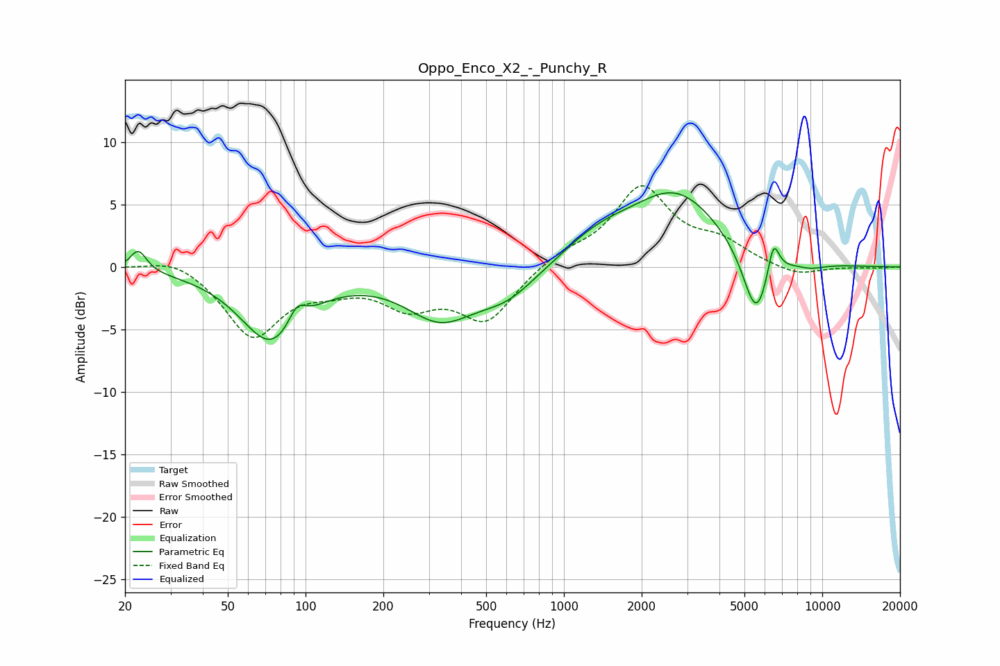

# Oppo_Enco_X2_-_Punchy_R
See [usage instructions](https://github.com/jaakkopasanen/AutoEq#usage) for more options and info.

### Parametric EQs
Apply preamp of -6.0 dB when using parametric equalizer.

|   # | Type    |   Fc (Hz) |    Q |   Gain (dB) |
|-----|---------|-----------|------|-------------|
|   1 | Peaking |        23 | 4.51 |         1.7 |
|   2 | Peaking |        74 | 1.16 |        -6   |
|   3 | Peaking |        92 | 4.03 |         1.7 |
|   4 | Peaking |       333 | 1.03 |        -3.8 |
|   5 | Peaking |       605 | 1.18 |        -2.1 |
|   6 | Peaking |      1357 | 1.02 |         1.7 |
|   7 | Peaking |      2722 | 0.78 |         5.8 |
|   8 | Peaking |      5548 | 2.66 |        -5.6 |
|   9 | Peaking |      6471 | 6    |         2.9 |
|  10 | Peaking |      8990 | 2.07 |        -0.4 |

### Fixed Band EQs
When using fixed band (also called graphic) equalizer, apply preamp of **-6.6 dB** (if available) and set gains manually with these parameters.

|   # | Type    |   Fc (Hz) |    Q |   Gain (dB) |
|-----|---------|-----------|------|-------------|
|   1 | Peaking |        31 | 1.41 |         1   |
|   2 | Peaking |        62 | 1.41 |        -5.5 |
|   3 | Peaking |       125 | 1.41 |        -1.1 |
|   4 | Peaking |       250 | 1.41 |        -2.7 |
|   5 | Peaking |       500 | 1.41 |        -4.2 |
|   6 | Peaking |      1000 | 1.41 |         1   |
|   7 | Peaking |      2000 | 1.41 |         6.2 |
|   8 | Peaking |      4000 | 1.41 |         1.6 |
|   9 | Peaking |      8000 | 1.41 |        -0.8 |
|  10 | Peaking |     16000 | 1.41 |        -0.1 |

### Graphs

