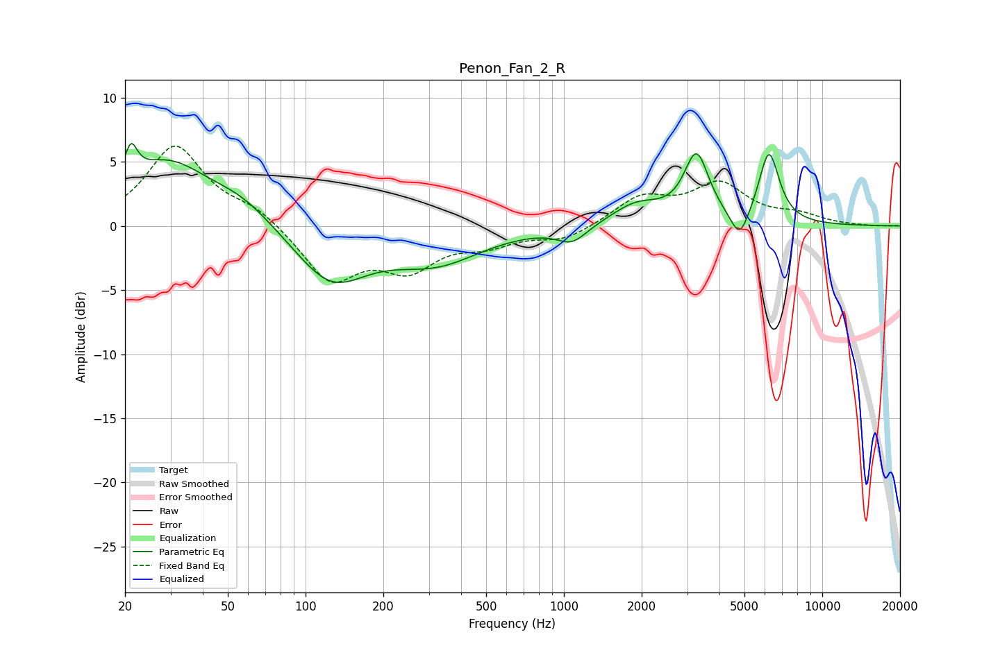

# Penon_Fan_2_R
See [usage instructions](https://github.com/jaakkopasanen/AutoEq#usage) for more options and info.

### Parametric EQs
Apply preamp of -6.5 dB when using parametric equalizer.

|   # | Type    |   Fc (Hz) |    Q |   Gain (dB) |
|-----|---------|-----------|------|-------------|
|   1 | Peaking |        21 | 5.75 |         2.6 |
|   2 | Peaking |        29 | 0.83 |         4.9 |
|   3 | Peaking |        57 | 1.18 |         1.4 |
|   4 | Peaking |       125 | 1.01 |        -4.3 |
|   5 | Peaking |       320 | 0.8  |        -2.6 |
|   6 | Peaking |      1077 | 2.44 |        -1.3 |
|   7 | Peaking |      1919 | 1.41 |         1.7 |
|   8 | Peaking |      3260 | 2.95 |         5.2 |
|   9 | Peaking |      4790 | 3.97 |        -2.3 |
|  10 | Peaking |      6220 | 3.48 |         5.6 |

### Fixed Band EQs
When using fixed band (also called graphic) equalizer, apply preamp of **-6.3 dB** (if available) and set gains manually with these parameters.

|   # | Type    |   Fc (Hz) |    Q |   Gain (dB) |
|-----|---------|-----------|------|-------------|
|   1 | Peaking |        31 | 1.41 |         6.2 |
|   2 | Peaking |        62 | 1.41 |         1.2 |
|   3 | Peaking |       125 | 1.41 |        -4.2 |
|   4 | Peaking |       250 | 1.41 |        -3   |
|   5 | Peaking |       500 | 1.41 |        -1.2 |
|   6 | Peaking |      1000 | 1.41 |        -1.1 |
|   7 | Peaking |      2000 | 1.41 |         2.1 |
|   8 | Peaking |      4000 | 1.41 |         3.1 |
|   9 | Peaking |      8000 | 1.41 |         0.7 |
|  10 | Peaking |     16000 | 1.41 |        -0   |

### Graphs

