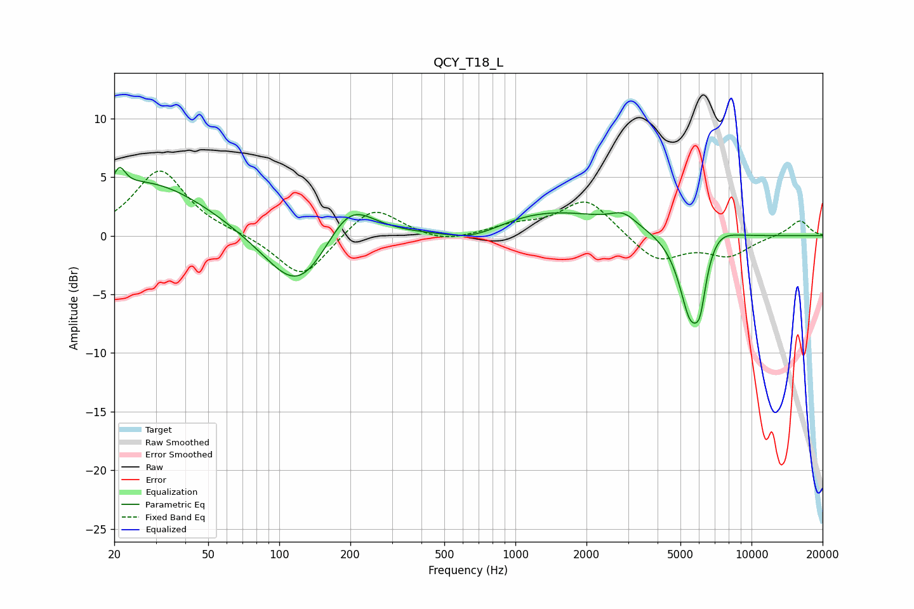

# QCY_T18_L
See [usage instructions](https://github.com/jaakkopasanen/AutoEq#usage) for more options and info.

### Parametric EQs
Apply preamp of -5.9 dB when using parametric equalizer.

|   # | Type    |   Fc (Hz) |    Q |   Gain (dB) |
|-----|---------|-----------|------|-------------|
|   1 | Peaking |        21 | 6    |         1.6 |
|   2 | Peaking |        27 | 0.53 |         4.7 |
|   3 | Peaking |       121 | 1    |        -5.6 |
|   4 | Peaking |       197 | 1.34 |         3.9 |
|   5 | Peaking |       667 | 1.06 |        -1.4 |
|   6 | Peaking |      1313 | 0.48 |         2.3 |
|   7 | Peaking |      2869 | 2.62 |         1   |
|   8 | Peaking |      5515 | 2.8  |        -7.1 |
|   9 | Peaking |      6063 | 5.77 |        -2.9 |
|  10 | Peaking |      7106 | 1.9  |         1.3 |

### Fixed Band EQs
When using fixed band (also called graphic) equalizer, apply preamp of **-5.6 dB** (if available) and set gains manually with these parameters.

|   # | Type    |   Fc (Hz) |    Q |   Gain (dB) |
|-----|---------|-----------|------|-------------|
|   1 | Peaking |        31 | 1.41 |         5.6 |
|   2 | Peaking |        62 | 1.41 |         0.2 |
|   3 | Peaking |       125 | 1.41 |        -3.8 |
|   4 | Peaking |       250 | 1.41 |         2.7 |
|   5 | Peaking |       500 | 1.41 |        -0.7 |
|   6 | Peaking |      1000 | 1.41 |         0.7 |
|   7 | Peaking |      2000 | 1.41 |         3.2 |
|   8 | Peaking |      4000 | 1.41 |        -2.3 |
|   9 | Peaking |      8000 | 1.41 |        -1.6 |
|  10 | Peaking |     16000 | 1.41 |         1.3 |

### Graphs

