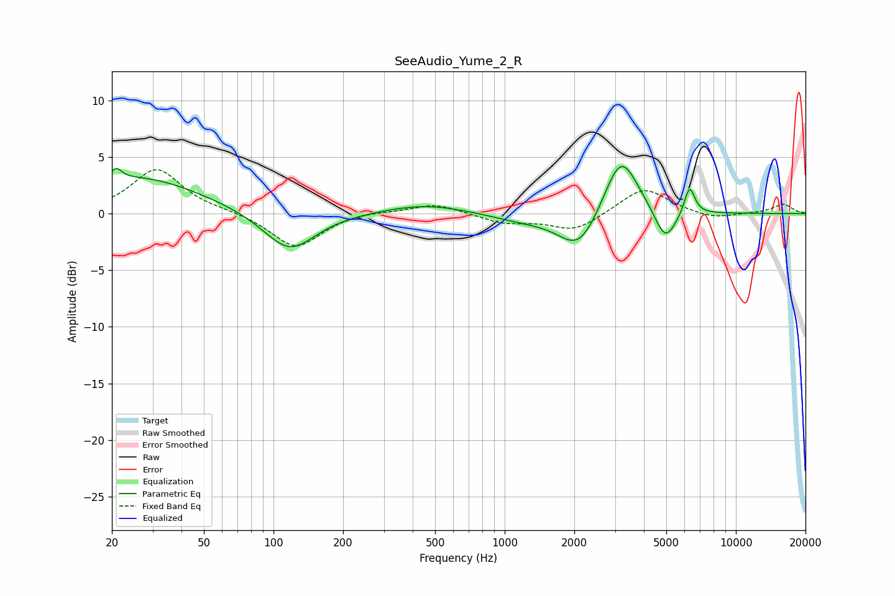

# SeeAudio_Yume_2_R
See [usage instructions](https://github.com/jaakkopasanen/AutoEq#usage) for more options and info.

### Parametric EQs
Apply preamp of -4.3 dB when using parametric equalizer.

|   # | Type    |   Fc (Hz) |    Q |   Gain (dB) |
|-----|---------|-----------|------|-------------|
|   1 | Peaking |        21 | 5.99 |         1   |
|   2 | Peaking |        26 | 0.51 |         3.2 |
|   3 | Peaking |       117 | 1.27 |        -3.5 |
|   4 | Peaking |       452 | 0.79 |         0.9 |
|   5 | Peaking |      1188 | 1.02 |        -0.6 |
|   6 | Peaking |      2099 | 1.6  |        -3.5 |
|   7 | Peaking |      3171 | 2.39 |         1.3 |
|   8 | Peaking |      3186 | 1.75 |         4.4 |
|   9 | Peaking |      4951 | 2.97 |        -2.9 |
|  10 | Peaking |      6302 | 6    |         2.5 |

### Fixed Band EQs
When using fixed band (also called graphic) equalizer, apply preamp of **-4.0 dB** (if available) and set gains manually with these parameters.

|   # | Type    |   Fc (Hz) |    Q |   Gain (dB) |
|-----|---------|-----------|------|-------------|
|   1 | Peaking |        31 | 1.41 |         3.9 |
|   2 | Peaking |        62 | 1.41 |         0.2 |
|   3 | Peaking |       125 | 1.41 |        -3.1 |
|   4 | Peaking |       250 | 1.41 |         0.2 |
|   5 | Peaking |       500 | 1.41 |         0.9 |
|   6 | Peaking |      1000 | 1.41 |        -0.8 |
|   7 | Peaking |      2000 | 1.41 |        -1.5 |
|   8 | Peaking |      4000 | 1.41 |         2.4 |
|   9 | Peaking |      8000 | 1.41 |        -0.5 |
|  10 | Peaking |     16000 | 1.41 |         0.8 |

### Graphs

