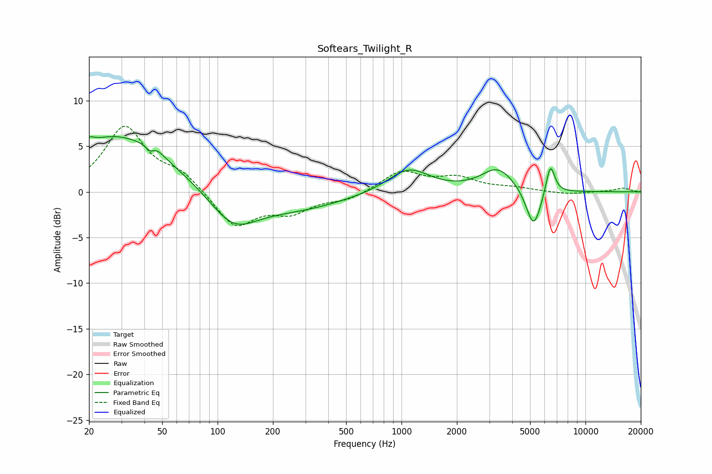

# Softears_Twilight_R
See [usage instructions](https://github.com/jaakkopasanen/AutoEq#usage) for more options and info.

### Parametric EQs
Apply preamp of -6.1 dB when using parametric equalizer.

|   # | Type    |   Fc (Hz) |    Q |   Gain (dB) |
|-----|---------|-----------|------|-------------|
|   1 | Peaking |        20 | 5.78 |         0.6 |
|   2 | Peaking |        28 | 0.49 |         6.2 |
|   3 | Peaking |        43 | 5.84 |        -1   |
|   4 | Peaking |        45 | 3.39 |         0.9 |
|   5 | Peaking |       122 | 1.09 |        -3.7 |
|   6 | Peaking |       263 | 0.54 |        -1.8 |
|   7 | Peaking |      1092 | 1.26 |         2.6 |
|   8 | Peaking |      3346 | 1.57 |         2.6 |
|   9 | Peaking |      5225 | 3.4  |        -4.4 |
|  10 | Peaking |      6449 | 5.71 |         3.4 |

### Fixed Band EQs
When using fixed band (also called graphic) equalizer, apply preamp of **-7.3 dB** (if available) and set gains manually with these parameters.

|   # | Type    |   Fc (Hz) |    Q |   Gain (dB) |
|-----|---------|-----------|------|-------------|
|   1 | Peaking |        31 | 1.41 |         7   |
|   2 | Peaking |        62 | 1.41 |         1.8 |
|   3 | Peaking |       125 | 1.41 |        -3.9 |
|   4 | Peaking |       250 | 1.41 |        -2   |
|   5 | Peaking |       500 | 1.41 |        -0.8 |
|   6 | Peaking |      1000 | 1.41 |         2.2 |
|   7 | Peaking |      2000 | 1.41 |         1.4 |
|   8 | Peaking |      4000 | 1.41 |         0.4 |
|   9 | Peaking |      8000 | 1.41 |        -0.3 |
|  10 | Peaking |     16000 | 1.41 |         0.4 |

### Graphs

