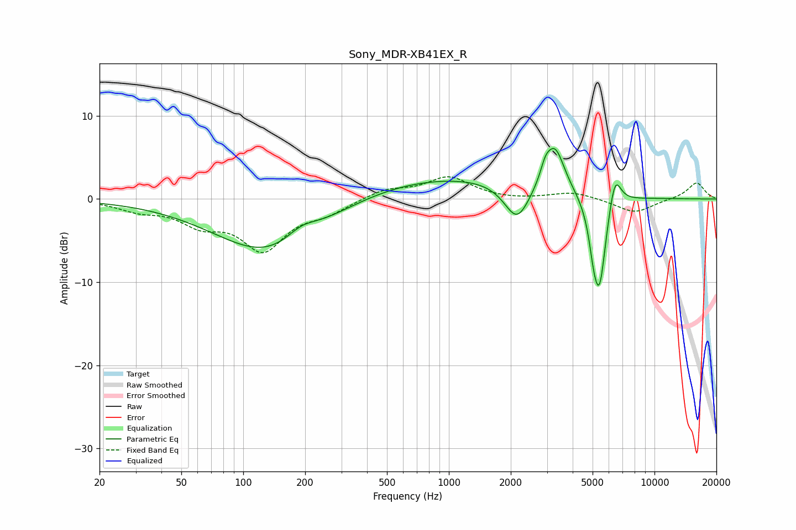

# Sony_MDR-XB41EX_R
See [usage instructions](https://github.com/jaakkopasanen/AutoEq#usage) for more options and info.

### Parametric EQs
Apply preamp of -6.2 dB when using parametric equalizer.

|   # | Type    |   Fc (Hz) |    Q |   Gain (dB) |
|-----|---------|-----------|------|-------------|
|   1 | Peaking |       135 | 0.53 |        -6.8 |
|   2 | Peaking |       194 | 1.83 |         1.8 |
|   3 | Peaking |       207 | 2.45 |        -0.2 |
|   4 | Peaking |       943 | 0.28 |         2.8 |
|   5 | Peaking |      2147 | 2.27 |        -4.6 |
|   6 | Peaking |      2944 | 5.99 |         1.5 |
|   7 | Peaking |      3279 | 2.99 |         5.4 |
|   8 | Peaking |      5072 | 6    |        -3.2 |
|   9 | Peaking |      5416 | 4.2  |       -10.4 |
|  10 | Peaking |      6417 | 4.6  |         4.1 |

### Fixed Band EQs
When using fixed band (also called graphic) equalizer, apply preamp of **-2.8 dB** (if available) and set gains manually with these parameters.

|   # | Type    |   Fc (Hz) |    Q |   Gain (dB) |
|-----|---------|-----------|------|-------------|
|   1 | Peaking |        31 | 1.41 |        -1.1 |
|   2 | Peaking |        62 | 1.41 |        -2.5 |
|   3 | Peaking |       125 | 1.41 |        -5.8 |
|   4 | Peaking |       250 | 1.41 |        -1.4 |
|   5 | Peaking |       500 | 1.41 |         1.2 |
|   6 | Peaking |      1000 | 1.41 |         2.6 |
|   7 | Peaking |      2000 | 1.41 |        -0.2 |
|   8 | Peaking |      4000 | 1.41 |         0.8 |
|   9 | Peaking |      8000 | 1.41 |        -1.7 |
|  10 | Peaking |     16000 | 1.41 |         2   |

### Graphs

