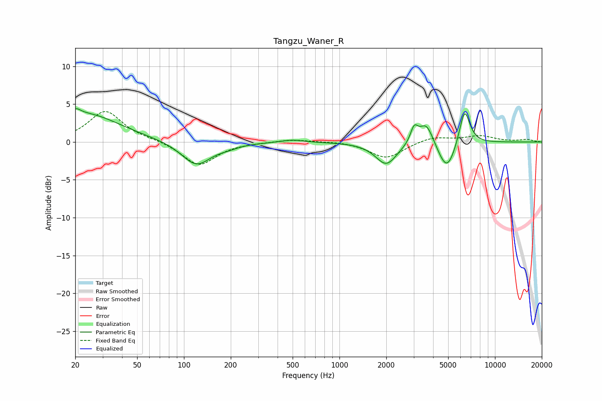

# Tangzu_Waner_R
See [usage instructions](https://github.com/jaakkopasanen/AutoEq#usage) for more options and info.

### Parametric EQs
Apply preamp of -4.5 dB when using parametric equalizer.

|   # | Type    |   Fc (Hz) |    Q |   Gain (dB) |
|-----|---------|-----------|------|-------------|
|   1 | Peaking |        20 | 4.89 |         0.8 |
|   2 | Peaking |        23 | 0.64 |         3.7 |
|   3 | Peaking |       120 | 1.51 |        -3.2 |
|   4 | Peaking |       193 | 2.09 |        -0.4 |
|   5 | Peaking |       498 | 2.04 |         0.4 |
|   6 | Peaking |      2000 | 2.06 |        -3   |
|   7 | Peaking |      3022 | 5.93 |         2   |
|   8 | Peaking |      3616 | 3    |         3   |
|   9 | Peaking |      4906 | 2.46 |        -4.1 |
|  10 | Peaking |      6371 | 3.94 |         4.9 |

### Fixed Band EQs
When using fixed band (also called graphic) equalizer, apply preamp of **-4.1 dB** (if available) and set gains manually with these parameters.

|   # | Type    |   Fc (Hz) |    Q |   Gain (dB) |
|-----|---------|-----------|------|-------------|
|   1 | Peaking |        31 | 1.41 |         4.1 |
|   2 | Peaking |        62 | 1.41 |         0.3 |
|   3 | Peaking |       125 | 1.41 |        -3.1 |
|   4 | Peaking |       250 | 1.41 |        -0   |
|   5 | Peaking |       500 | 1.41 |         0.4 |
|   6 | Peaking |      1000 | 1.41 |         0.1 |
|   7 | Peaking |      2000 | 1.41 |        -2.2 |
|   8 | Peaking |      4000 | 1.41 |         0.7 |
|   9 | Peaking |      8000 | 1.41 |         0.8 |
|  10 | Peaking |     16000 | 1.41 |         0.3 |

### Graphs

