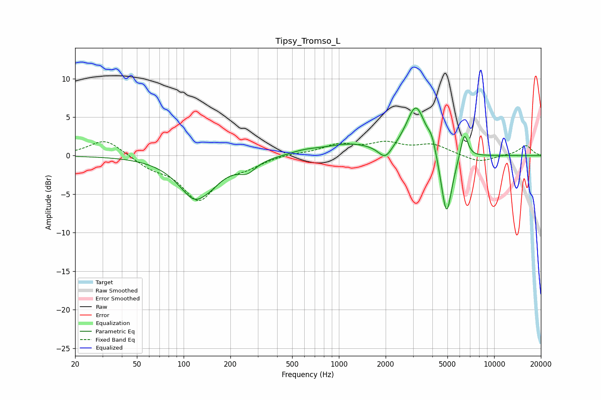

# Tipsy_Tromso_L
See [usage instructions](https://github.com/jaakkopasanen/AutoEq#usage) for more options and info.

### Parametric EQs
Apply preamp of -6.3 dB when using parametric equalizer.

|   # | Type    |   Fc (Hz) |    Q |   Gain (dB) |
|-----|---------|-----------|------|-------------|
|   1 | Peaking |       123 | 1.28 |        -6.1 |
|   2 | Peaking |       131 | 2.98 |         0.6 |
|   3 | Peaking |       257 | 2.61 |        -1.3 |
|   4 | Peaking |       603 | 1.48 |         0.5 |
|   5 | Peaking |      1179 | 0.85 |         1.4 |
|   6 | Peaking |      1990 | 3.27 |        -1.8 |
|   7 | Peaking |      3136 | 2.28 |         6.4 |
|   8 | Peaking |      3972 | 5.27 |         1.6 |
|   9 | Peaking |      4933 | 3.87 |        -8.7 |
|  10 | Peaking |      6415 | 5.57 |         3.5 |

### Fixed Band EQs
When using fixed band (also called graphic) equalizer, apply preamp of **-2.0 dB** (if available) and set gains manually with these parameters.

|   # | Type    |   Fc (Hz) |    Q |   Gain (dB) |
|-----|---------|-----------|------|-------------|
|   1 | Peaking |        31 | 1.41 |         2.2 |
|   2 | Peaking |        62 | 1.41 |        -1.3 |
|   3 | Peaking |       125 | 1.41 |        -5.5 |
|   4 | Peaking |       250 | 1.41 |        -1.1 |
|   5 | Peaking |       500 | 1.41 |         0.3 |
|   6 | Peaking |      1000 | 1.41 |         1.3 |
|   7 | Peaking |      2000 | 1.41 |         1.4 |
|   8 | Peaking |      4000 | 1.41 |         1.3 |
|   9 | Peaking |      8000 | 1.41 |        -0.9 |
|  10 | Peaking |     16000 | 1.41 |         1.3 |

### Graphs

