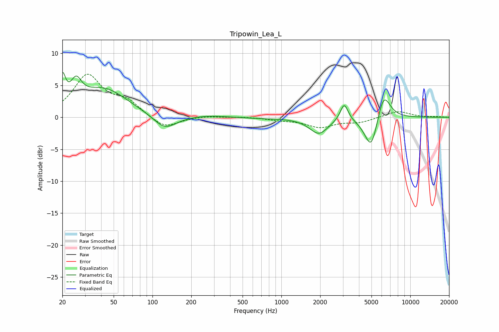

# Tripowin_Lea_L
See [usage instructions](https://github.com/jaakkopasanen/AutoEq#usage) for more options and info.

### Parametric EQs
Apply preamp of -7.1 dB when using parametric equalizer.

|   # | Type    |   Fc (Hz) |    Q |   Gain (dB) |
|-----|---------|-----------|------|-------------|
|   1 | Peaking |        20 | 5.96 |         4.4 |
|   2 | Peaking |        26 | 3.35 |         3.3 |
|   3 | Peaking |        42 | 0.77 |         4.4 |
|   4 | Peaking |       124 | 1.57 |        -2.3 |
|   5 | Peaking |       274 | 1.06 |         0.3 |
|   6 | Peaking |       715 | 0.82 |        -0.1 |
|   7 | Peaking |      1954 | 1.95 |        -2.5 |
|   8 | Peaking |      3072 | 4.63 |         2.8 |
|   9 | Peaking |      4986 | 2.68 |        -5.5 |
|  10 | Peaking |      6191 | 2.65 |         4.6 |

### Fixed Band EQs
When using fixed band (also called graphic) equalizer, apply preamp of **-6.8 dB** (if available) and set gains manually with these parameters.

|   # | Type    |   Fc (Hz) |    Q |   Gain (dB) |
|-----|---------|-----------|------|-------------|
|   1 | Peaking |        31 | 1.41 |         6.4 |
|   2 | Peaking |        62 | 1.41 |         2.2 |
|   3 | Peaking |       125 | 1.41 |        -1.9 |
|   4 | Peaking |       250 | 1.41 |         0.2 |
|   5 | Peaking |       500 | 1.41 |         0.1 |
|   6 | Peaking |      1000 | 1.41 |        -0.4 |
|   7 | Peaking |      2000 | 1.41 |        -1.5 |
|   8 | Peaking |      4000 | 1.41 |        -0.7 |
|   9 | Peaking |      8000 | 1.41 |         1   |
|  10 | Peaking |     16000 | 1.41 |         0.1 |

### Graphs

