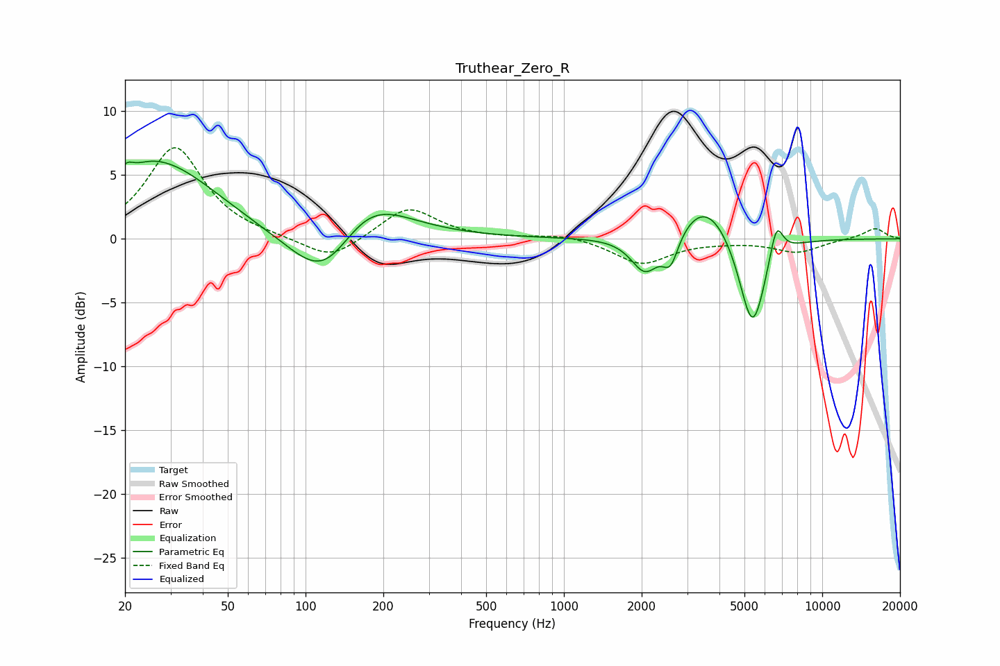

# Truthear_Zero_R
See [usage instructions](https://github.com/jaakkopasanen/AutoEq#usage) for more options and info.

### Parametric EQs
Apply preamp of -6.2 dB when using parametric equalizer.

|   # | Type    |   Fc (Hz) |    Q |   Gain (dB) |
|-----|---------|-----------|------|-------------|
|   1 | Peaking |        20 | 5.64 |         0.9 |
|   2 | Peaking |        25 | 2.09 |         0.3 |
|   3 | Peaking |        28 | 0.65 |         5.8 |
|   4 | Peaking |       120 | 1.01 |        -5.9 |
|   5 | Peaking |       167 | 0.88 |         4.8 |
|   6 | Peaking |      2064 | 2.57 |        -3   |
|   7 | Peaking |      2587 | 4.53 |        -2.4 |
|   8 | Peaking |      3558 | 1.31 |         3.4 |
|   9 | Peaking |      5369 | 2.61 |        -7.9 |
|  10 | Peaking |      6641 | 5.2  |         2.9 |

### Fixed Band EQs
When using fixed band (also called graphic) equalizer, apply preamp of **-7.2 dB** (if available) and set gains manually with these parameters.

|   # | Type    |   Fc (Hz) |    Q |   Gain (dB) |
|-----|---------|-----------|------|-------------|
|   1 | Peaking |        31 | 1.41 |         7.2 |
|   2 | Peaking |        62 | 1.41 |         0.1 |
|   3 | Peaking |       125 | 1.41 |        -1.8 |
|   4 | Peaking |       250 | 1.41 |         2.5 |
|   5 | Peaking |       500 | 1.41 |         0   |
|   6 | Peaking |      1000 | 1.41 |         0.4 |
|   7 | Peaking |      2000 | 1.41 |        -2   |
|   8 | Peaking |      4000 | 1.41 |        -0.1 |
|   9 | Peaking |      8000 | 1.41 |        -1   |
|  10 | Peaking |     16000 | 1.41 |         0.8 |

### Graphs

