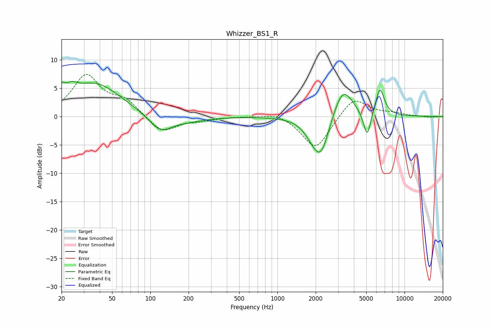

# Whizzer_BS1_R
See [usage instructions](https://github.com/jaakkopasanen/AutoEq#usage) for more options and info.

### Parametric EQs
Apply preamp of -6.3 dB when using parametric equalizer.

|   # | Type    |   Fc (Hz) |    Q |   Gain (dB) |
|-----|---------|-----------|------|-------------|
|   1 | Peaking |        20 | 6    |         2   |
|   2 | Peaking |        24 | 2.92 |         1.8 |
|   3 | Peaking |        37 | 0.71 |         5.8 |
|   4 | Peaking |       120 | 1.58 |        -3   |
|   5 | Peaking |       193 | 0.96 |        -0.8 |
|   6 | Peaking |      1895 | 2.17 |        -1.9 |
|   7 | Peaking |      2213 | 2.15 |        -6.6 |
|   8 | Peaking |      3273 | 1.79 |         5.8 |
|   9 | Peaking |      5082 | 4.78 |        -4.8 |
|  10 | Peaking |      6405 | 4    |         4.9 |

### Fixed Band EQs
When using fixed band (also called graphic) equalizer, apply preamp of **-7.5 dB** (if available) and set gains manually with these parameters.

|   # | Type    |   Fc (Hz) |    Q |   Gain (dB) |
|-----|---------|-----------|------|-------------|
|   1 | Peaking |        31 | 1.41 |         7.1 |
|   2 | Peaking |        62 | 1.41 |         2.6 |
|   3 | Peaking |       125 | 1.41 |        -3   |
|   4 | Peaking |       250 | 1.41 |        -0.6 |
|   5 | Peaking |       500 | 1.41 |         0.1 |
|   6 | Peaking |      1000 | 1.41 |         0.8 |
|   7 | Peaking |      2000 | 1.41 |        -5.9 |
|   8 | Peaking |      4000 | 1.41 |         3.6 |
|   9 | Peaking |      8000 | 1.41 |         0.5 |
|  10 | Peaking |     16000 | 1.41 |        -0.2 |

### Graphs

