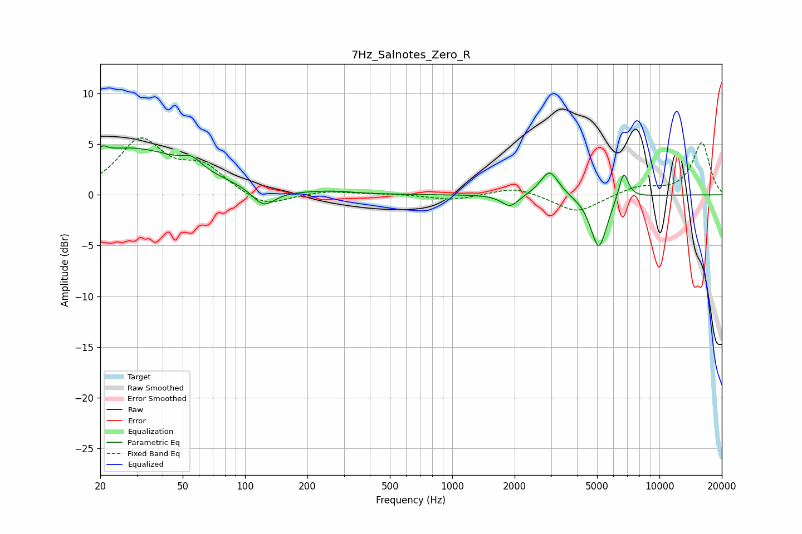

# 7Hz_Salnotes_Zero_R
See [usage instructions](https://github.com/jaakkopasanen/AutoEq#usage) for more options and info.

### Parametric EQs
Apply preamp of -4.9 dB when using parametric equalizer.

|   # | Type    |   Fc (Hz) |    Q |   Gain (dB) |
|-----|---------|-----------|------|-------------|
|   1 | Peaking |        20 | 5.98 |        -2.5 |
|   2 | Peaking |        20 | 5.99 |         3.2 |
|   3 | Peaking |        28 | 0.5  |         4.5 |
|   4 | Peaking |        55 | 3.1  |         1   |
|   5 | Peaking |       123 | 2.58 |        -1.8 |
|   6 | Peaking |       263 | 1.43 |         0.2 |
|   7 | Peaking |      1904 | 3.44 |        -1.2 |
|   8 | Peaking |      2947 | 3.24 |         2.5 |
|   9 | Peaking |      5099 | 3.5  |        -5.3 |
|  10 | Peaking |      6719 | 5.72 |         2.8 |

### Fixed Band EQs
When using fixed band (also called graphic) equalizer, apply preamp of **-5.7 dB** (if available) and set gains manually with these parameters.

|   # | Type    |   Fc (Hz) |    Q |   Gain (dB) |
|-----|---------|-----------|------|-------------|
|   1 | Peaking |        31 | 1.41 |         5.2 |
|   2 | Peaking |        62 | 1.41 |         2.5 |
|   3 | Peaking |       125 | 1.41 |        -1.3 |
|   4 | Peaking |       250 | 1.41 |         0.4 |
|   5 | Peaking |       500 | 1.41 |         0.1 |
|   6 | Peaking |      1000 | 1.41 |        -0.5 |
|   7 | Peaking |      2000 | 1.41 |         0.8 |
|   8 | Peaking |      4000 | 1.41 |        -1.8 |
|   9 | Peaking |      8000 | 1.41 |         0.8 |
|  10 | Peaking |     16000 | 1.41 |         5.1 |

### Graphs

