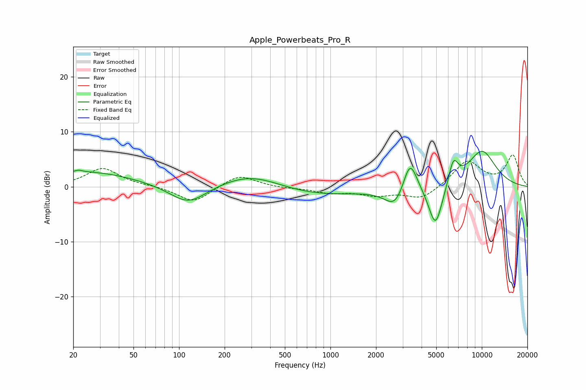

# Apple_Powerbeats_Pro_R
See [usage instructions](https://github.com/jaakkopasanen/AutoEq#usage) for more options and info.

### Parametric EQs
Apply preamp of -6.5 dB when using parametric equalizer.

|   # | Type    |   Fc (Hz) |    Q |   Gain (dB) |
|-----|---------|-----------|------|-------------|
|   1 | Peaking |        22 | 5.65 |         0.4 |
|   2 | Peaking |        24 | 0.44 |         2.7 |
|   3 | Peaking |       115 | 1.15 |        -3.6 |
|   4 | Peaking |       304 | 0.67 |         3.1 |
|   5 | Peaking |       691 | 0.41 |        -1.9 |
|   6 | Peaking |      2692 | 2.07 |        -3.9 |
|   7 | Peaking |      3352 | 2.92 |         6.5 |
|   8 | Peaking |      4943 | 2.92 |        -8.1 |
|   9 | Peaking |      6484 | 4.21 |         4.4 |
|  10 | Peaking |     10000 | 1.24 |         6.5 |

### Fixed Band EQs
When using fixed band (also called graphic) equalizer, apply preamp of **-5.9 dB** (if available) and set gains manually with these parameters.

|   # | Type    |   Fc (Hz) |    Q |   Gain (dB) |
|-----|---------|-----------|------|-------------|
|   1 | Peaking |        31 | 1.41 |         3.4 |
|   2 | Peaking |        62 | 1.41 |         0.2 |
|   3 | Peaking |       125 | 1.41 |        -2.9 |
|   4 | Peaking |       250 | 1.41 |         2.3 |
|   5 | Peaking |       500 | 1.41 |        -0.2 |
|   6 | Peaking |      1000 | 1.41 |        -1   |
|   7 | Peaking |      2000 | 1.41 |        -1.4 |
|   8 | Peaking |      4000 | 1.41 |        -2.3 |
|   9 | Peaking |      8000 | 1.41 |         4.7 |
|  10 | Peaking |     16000 | 1.41 |         5.6 |

### Graphs

