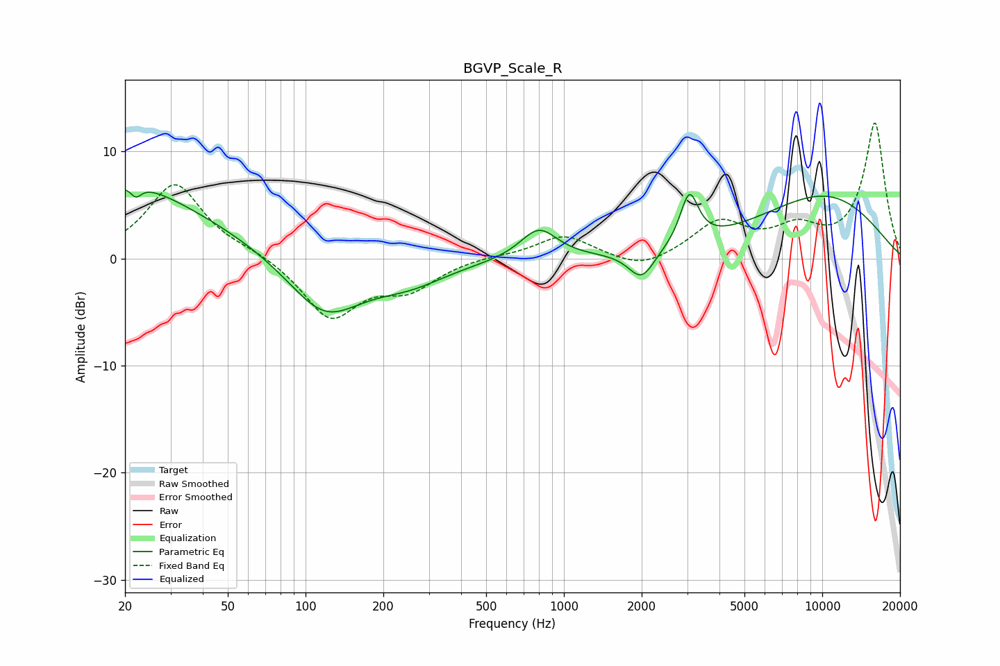

# BGVP_Scale_R
See [usage instructions](https://github.com/jaakkopasanen/AutoEq#usage) for more options and info.

### Parametric EQs
Apply preamp of -6.5 dB when using parametric equalizer.

|   # | Type    |   Fc (Hz) |    Q |   Gain (dB) |
|-----|---------|-----------|------|-------------|
|   1 | Peaking |        20 | 0.63 |         6   |
|   2 | Peaking |        22 | 5.31 |         2   |
|   3 | Peaking |        22 | 5.91 |        -2.9 |
|   4 | Peaking |        44 | 0.54 |         1.6 |
|   5 | Peaking |       118 | 0.99 |        -5.4 |
|   6 | Peaking |       251 | 0.95 |        -1.9 |
|   7 | Peaking |       799 | 1.98 |         2.9 |
|   8 | Peaking |      1998 | 2.82 |        -2.7 |
|   9 | Peaking |      3058 | 4.05 |         4.8 |
|  10 | Peaking |     10000 | 0.46 |         5.8 |

### Fixed Band EQs
When using fixed band (also called graphic) equalizer, apply preamp of **-12.8 dB** (if available) and set gains manually with these parameters.

|   # | Type    |   Fc (Hz) |    Q |   Gain (dB) |
|-----|---------|-----------|------|-------------|
|   1 | Peaking |        31 | 1.41 |         7   |
|   2 | Peaking |        62 | 1.41 |         0.5 |
|   3 | Peaking |       125 | 1.41 |        -5.5 |
|   4 | Peaking |       250 | 1.41 |        -2.5 |
|   5 | Peaking |       500 | 1.41 |         0.2 |
|   6 | Peaking |      1000 | 1.41 |         2.2 |
|   7 | Peaking |      2000 | 1.41 |        -1.2 |
|   8 | Peaking |      4000 | 1.41 |         3.3 |
|   9 | Peaking |      8000 | 1.41 |         2.4 |
|  10 | Peaking |     16000 | 1.41 |        12.6 |

### Graphs

