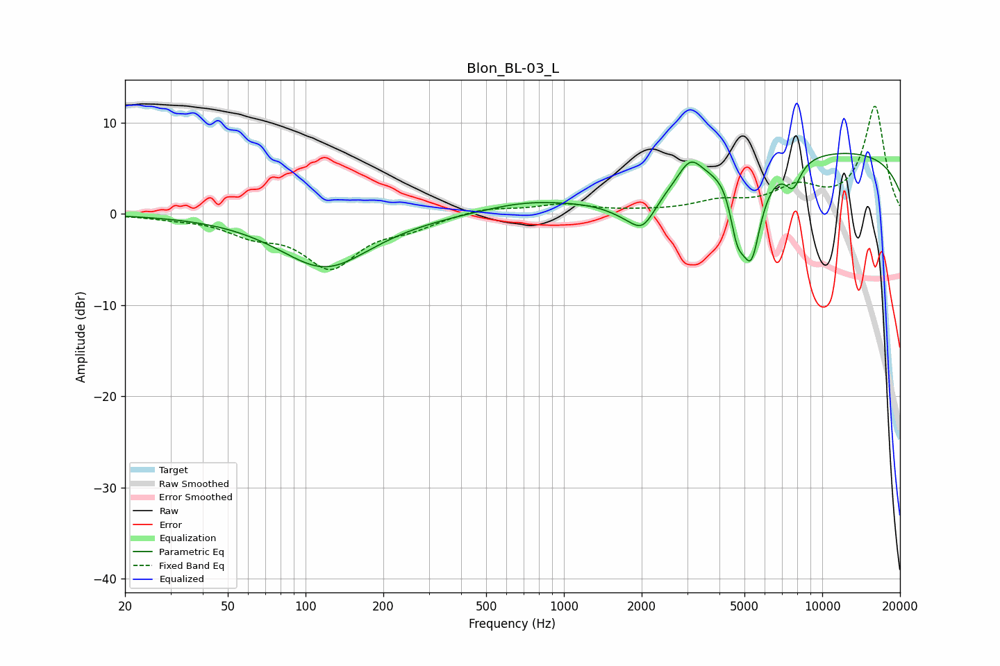

# Blon_BL-03_L
See [usage instructions](https://github.com/jaakkopasanen/AutoEq#usage) for more options and info.

### Parametric EQs
Apply preamp of -6.7 dB when using parametric equalizer.

|   # | Type    |   Fc (Hz) |    Q |   Gain (dB) |
|-----|---------|-----------|------|-------------|
|   1 | Peaking |       119 | 0.8  |        -5.9 |
|   2 | Peaking |       701 | 0.86 |         1   |
|   3 | Peaking |      1845 | 1.41 |        -2.5 |
|   4 | Peaking |      2027 | 2.99 |        -2.4 |
|   5 | Peaking |      3081 | 3.09 |         2.6 |
|   6 | Peaking |      4518 | 2.15 |         8.9 |
|   7 | Peaking |      4662 | 2.67 |       -14.2 |
|   8 | Peaking |      5326 | 3.74 |        -8   |
|   9 | Peaking |      7708 | 4.27 |        -2.8 |
|  10 | Peaking |     10000 | 0.18 |         7   |

### Fixed Band EQs
When using fixed band (also called graphic) equalizer, apply preamp of **-11.9 dB** (if available) and set gains manually with these parameters.

|   # | Type    |   Fc (Hz) |    Q |   Gain (dB) |
|-----|---------|-----------|------|-------------|
|   1 | Peaking |        31 | 1.41 |        -0.3 |
|   2 | Peaking |        62 | 1.41 |        -1.8 |
|   3 | Peaking |       125 | 1.41 |        -5.6 |
|   4 | Peaking |       250 | 1.41 |        -1.2 |
|   5 | Peaking |       500 | 1.41 |         0.7 |
|   6 | Peaking |      1000 | 1.41 |         1   |
|   7 | Peaking |      2000 | 1.41 |         0.2 |
|   8 | Peaking |      4000 | 1.41 |         1.2 |
|   9 | Peaking |      8000 | 1.41 |         2.5 |
|  10 | Peaking |     16000 | 1.41 |        11.7 |

### Graphs

