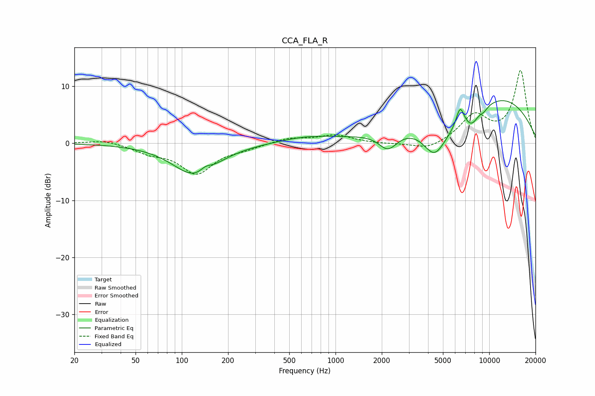

# CCA_FLA_R
See [usage instructions](https://github.com/jaakkopasanen/AutoEq#usage) for more options and info.

### Parametric EQs
Apply preamp of -7.6 dB when using parametric equalizer.

|   # | Type    |   Fc (Hz) |    Q |   Gain (dB) |
|-----|---------|-----------|------|-------------|
|   1 | Peaking |       122 | 0.98 |        -5.6 |
|   2 | Peaking |       142 | 3.95 |         0.9 |
|   3 | Peaking |       661 | 0.77 |         1   |
|   4 | Peaking |      2196 | 2.32 |        -3.1 |
|   5 | Peaking |      4401 | 1.9  |        -5.2 |
|   6 | Peaking |      6398 | 0.69 |        -5.2 |
|   7 | Peaking |      6465 | 5.05 |         3.7 |
|   8 | Peaking |      7690 | 3.11 |        -1.8 |
|   9 | Peaking |      9069 | 0.31 |        10.5 |
|  10 | Peaking |      9251 | 5.24 |        -0.6 |

### Fixed Band EQs
When using fixed band (also called graphic) equalizer, apply preamp of **-12.9 dB** (if available) and set gains manually with these parameters.

|   # | Type    |   Fc (Hz) |    Q |   Gain (dB) |
|-----|---------|-----------|------|-------------|
|   1 | Peaking |        31 | 1.41 |         0.7 |
|   2 | Peaking |        62 | 1.41 |        -1.4 |
|   3 | Peaking |       125 | 1.41 |        -5.1 |
|   4 | Peaking |       250 | 1.41 |        -0.7 |
|   5 | Peaking |       500 | 1.41 |         0.9 |
|   6 | Peaking |      1000 | 1.41 |         1.4 |
|   7 | Peaking |      2000 | 1.41 |        -0.1 |
|   8 | Peaking |      4000 | 1.41 |        -1.3 |
|   9 | Peaking |      8000 | 1.41 |         4.7 |
|  10 | Peaking |     16000 | 1.41 |        12.6 |

### Graphs

