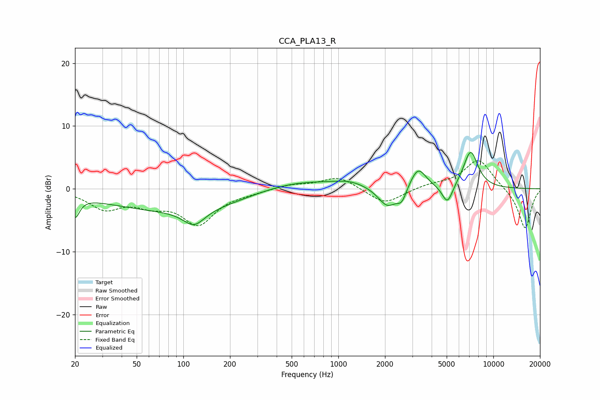

# CCA_PLA13_R
See [usage instructions](https://github.com/jaakkopasanen/AutoEq#usage) for more options and info.

### Parametric EQs
Apply preamp of -5.9 dB when using parametric equalizer.

|   # | Type    |   Fc (Hz) |    Q |   Gain (dB) |
|-----|---------|-----------|------|-------------|
|   1 | Peaking |        20 | 4.95 |        -3.2 |
|   2 | Peaking |       117 | 2.04 |        -2.6 |
|   3 | Peaking |       126 | 0.22 |        -3.8 |
|   4 | Peaking |       458 | 0.49 |         3   |
|   5 | Peaking |      1193 | 1.4  |         0.8 |
|   6 | Peaking |      2076 | 2.31 |        -3.2 |
|   7 | Peaking |      2566 | 4.59 |        -2   |
|   8 | Peaking |      3267 | 2.75 |         3.5 |
|   9 | Peaking |      5057 | 3.99 |        -3.1 |
|  10 | Peaking |      7137 | 2.81 |         6   |

### Fixed Band EQs
When using fixed band (also called graphic) equalizer, apply preamp of **-4.6 dB** (if available) and set gains manually with these parameters.

|   # | Type    |   Fc (Hz) |    Q |   Gain (dB) |
|-----|---------|-----------|------|-------------|
|   1 | Peaking |        31 | 1.41 |        -3   |
|   2 | Peaking |        62 | 1.41 |        -2   |
|   3 | Peaking |       125 | 1.41 |        -5.4 |
|   4 | Peaking |       250 | 1.41 |        -0.4 |
|   5 | Peaking |       500 | 1.41 |         0.7 |
|   6 | Peaking |      1000 | 1.41 |         2   |
|   7 | Peaking |      2000 | 1.41 |        -2.5 |
|   8 | Peaking |      4000 | 1.41 |         0.6 |
|   9 | Peaking |      8000 | 1.41 |         4.8 |
|  10 | Peaking |     16000 | 1.41 |        -6.5 |

### Graphs

