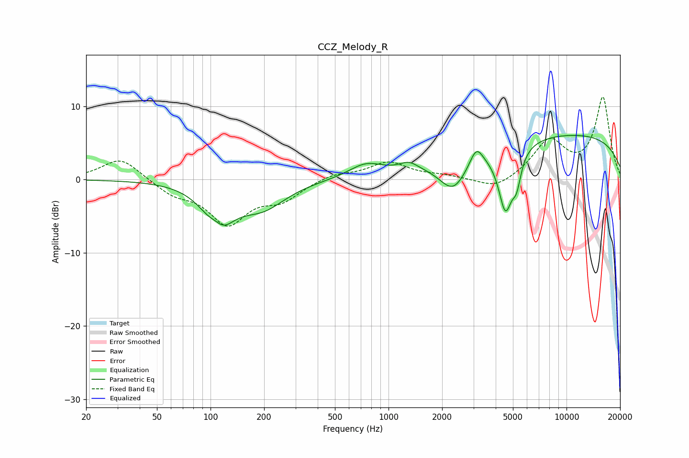

# CCZ_Melody_R
See [usage instructions](https://github.com/jaakkopasanen/AutoEq#usage) for more options and info.

### Parametric EQs
Apply preamp of -6.1 dB when using parametric equalizer.

|   # | Type    |   Fc (Hz) |    Q |   Gain (dB) |
|-----|---------|-----------|------|-------------|
|   1 | Peaking |       107 | 3.52 |         1.5 |
|   2 | Peaking |       110 | 1.72 |        -6.1 |
|   3 | Peaking |       196 | 1.07 |        -3.5 |
|   4 | Peaking |       746 | 1.48 |         1.8 |
|   5 | Peaking |      1302 | 2.68 |         1.1 |
|   6 | Peaking |      2312 | 1.79 |        -4.4 |
|   7 | Peaking |      3114 | 3.95 |         2.5 |
|   8 | Peaking |      4539 | 3.45 |        -8.5 |
|   9 | Peaking |      5245 | 5.65 |        -3.4 |
|  10 | Peaking |      9513 | 0.2  |         6.2 |

### Fixed Band EQs
When using fixed band (also called graphic) equalizer, apply preamp of **-11.3 dB** (if available) and set gains manually with these parameters.

|   # | Type    |   Fc (Hz) |    Q |   Gain (dB) |
|-----|---------|-----------|------|-------------|
|   1 | Peaking |        31 | 1.41 |         3   |
|   2 | Peaking |        62 | 1.41 |        -1.8 |
|   3 | Peaking |       125 | 1.41 |        -5.8 |
|   4 | Peaking |       250 | 1.41 |        -2.4 |
|   5 | Peaking |       500 | 1.41 |         0.8 |
|   6 | Peaking |      1000 | 1.41 |         2.3 |
|   7 | Peaking |      2000 | 1.41 |         0.4 |
|   8 | Peaking |      4000 | 1.41 |        -1.5 |
|   9 | Peaking |      8000 | 1.41 |         5.1 |
|  10 | Peaking |     16000 | 1.41 |        11.1 |

### Graphs

