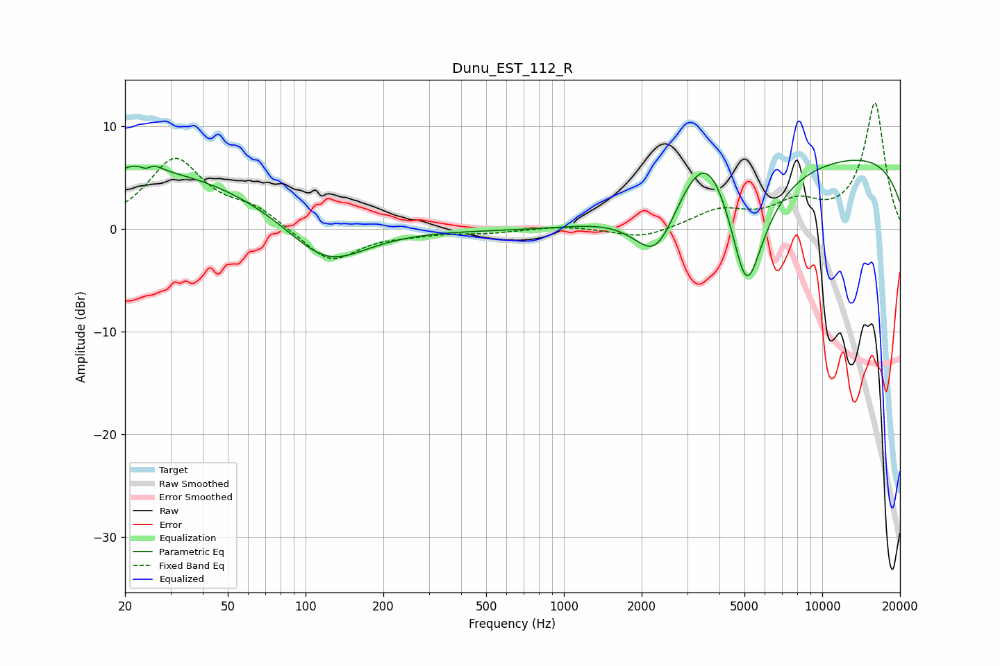

# Dunu_EST_112_R
See [usage instructions](https://github.com/jaakkopasanen/AutoEq#usage) for more options and info.

### Parametric EQs
Apply preamp of -6.8 dB when using parametric equalizer.

|   # | Type    |   Fc (Hz) |    Q |   Gain (dB) |
|-----|---------|-----------|------|-------------|
|   1 | Peaking |        21 | 2.92 |         0.4 |
|   2 | Peaking |        24 | 5.48 |        -3.2 |
|   3 | Peaking |        25 | 4.65 |         3.4 |
|   4 | Peaking |        25 | 0.33 |         5.7 |
|   5 | Peaking |       121 | 0.93 |        -4.4 |
|   6 | Peaking |      2281 | 1.57 |        -6.4 |
|   7 | Peaking |      3587 | 1.2  |         7.6 |
|   8 | Peaking |      3698 | 0.21 |        -1.4 |
|   9 | Peaking |      5088 | 1.8  |       -13.8 |
|  10 | Peaking |      9748 | 0.18 |         8   |

### Fixed Band EQs
When using fixed band (also called graphic) equalizer, apply preamp of **-12.4 dB** (if available) and set gains manually with these parameters.

|   # | Type    |   Fc (Hz) |    Q |   Gain (dB) |
|-----|---------|-----------|------|-------------|
|   1 | Peaking |        31 | 1.41 |         6.7 |
|   2 | Peaking |        62 | 1.41 |         1.7 |
|   3 | Peaking |       125 | 1.41 |        -3.3 |
|   4 | Peaking |       250 | 1.41 |        -0.4 |
|   5 | Peaking |       500 | 1.41 |        -0.3 |
|   6 | Peaking |      1000 | 1.41 |         0.3 |
|   7 | Peaking |      2000 | 1.41 |        -1   |
|   8 | Peaking |      4000 | 1.41 |         1.7 |
|   9 | Peaking |      8000 | 1.41 |         2.2 |
|  10 | Peaking |     16000 | 1.41 |        12.2 |

### Graphs

