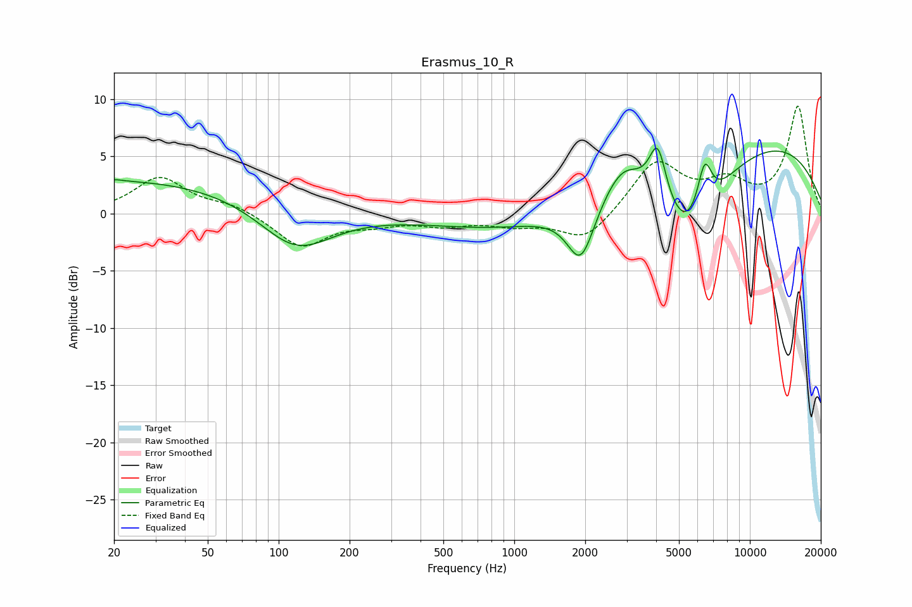

# Erasmus_10_R
See [usage instructions](https://github.com/jaakkopasanen/AutoEq#usage) for more options and info.

### Parametric EQs
Apply preamp of -5.8 dB when using parametric equalizer.

|   # | Type    |   Fc (Hz) |    Q |   Gain (dB) |
|-----|---------|-----------|------|-------------|
|   1 | Peaking |        20 | 0.18 |         3   |
|   2 | Peaking |        20 | 5.45 |         0.1 |
|   3 | Peaking |       118 | 0.91 |        -4.1 |
|   4 | Peaking |      1918 | 2.43 |        -5   |
|   5 | Peaking |      2100 | 0.29 |        -4.2 |
|   6 | Peaking |      2902 | 1.62 |         3.4 |
|   7 | Peaking |      4063 | 3.74 |         5.1 |
|   8 | Peaking |      5522 | 1.04 |        -7   |
|   9 | Peaking |      6423 | 4.31 |         4.5 |
|  10 | Peaking |      6931 | 0.19 |         7.8 |

### Fixed Band EQs
When using fixed band (also called graphic) equalizer, apply preamp of **-9.5 dB** (if available) and set gains manually with these parameters.

|   # | Type    |   Fc (Hz) |    Q |   Gain (dB) |
|-----|---------|-----------|------|-------------|
|   1 | Peaking |        31 | 1.41 |         3.1 |
|   2 | Peaking |        62 | 1.41 |         0.8 |
|   3 | Peaking |       125 | 1.41 |        -2.9 |
|   4 | Peaking |       250 | 1.41 |        -0.7 |
|   5 | Peaking |       500 | 1.41 |        -0.8 |
|   6 | Peaking |      1000 | 1.41 |        -0.8 |
|   7 | Peaking |      2000 | 1.41 |        -2.5 |
|   8 | Peaking |      4000 | 1.41 |         4.5 |
|   9 | Peaking |      8000 | 1.41 |         2.4 |
|  10 | Peaking |     16000 | 1.41 |         9.3 |

### Graphs

