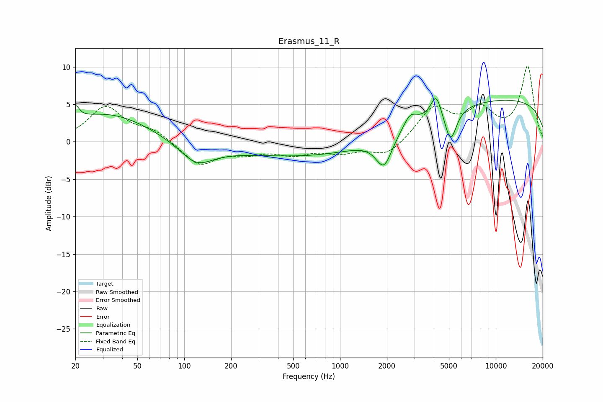

# Erasmus_11_R
See [usage instructions](https://github.com/jaakkopasanen/AutoEq#usage) for more options and info.

### Parametric EQs
Apply preamp of -5.9 dB when using parametric equalizer.

|   # | Type    |   Fc (Hz) |    Q |   Gain (dB) |
|-----|---------|-----------|------|-------------|
|   1 | Peaking |        20 | 5.97 |         1.8 |
|   2 | Peaking |        32 | 0.49 |         3.9 |
|   3 | Peaking |       120 | 1.35 |        -2.6 |
|   4 | Peaking |       392 | 0.22 |        -1.4 |
|   5 | Peaking |      1451 | 0.25 |        -1   |
|   6 | Peaking |      1915 | 2.69 |        -4.2 |
|   7 | Peaking |      2817 | 3.32 |         1.8 |
|   8 | Peaking |      4140 | 4.21 |         3.1 |
|   9 | Peaking |      5125 | 3.69 |        -4.4 |
|  10 | Peaking |     10000 | 0.18 |         5.8 |

### Fixed Band EQs
When using fixed band (also called graphic) equalizer, apply preamp of **-10.2 dB** (if available) and set gains manually with these parameters.

|   # | Type    |   Fc (Hz) |    Q |   Gain (dB) |
|-----|---------|-----------|------|-------------|
|   1 | Peaking |        31 | 1.41 |         4.6 |
|   2 | Peaking |        62 | 1.41 |         1.4 |
|   3 | Peaking |       125 | 1.41 |        -3.1 |
|   4 | Peaking |       250 | 1.41 |        -1.2 |
|   5 | Peaking |       500 | 1.41 |        -1.4 |
|   6 | Peaking |      1000 | 1.41 |        -1.2 |
|   7 | Peaking |      2000 | 1.41 |        -2   |
|   8 | Peaking |      4000 | 1.41 |         4.4 |
|   9 | Peaking |      8000 | 1.41 |         3.8 |
|  10 | Peaking |     16000 | 1.41 |         9.9 |

### Graphs

