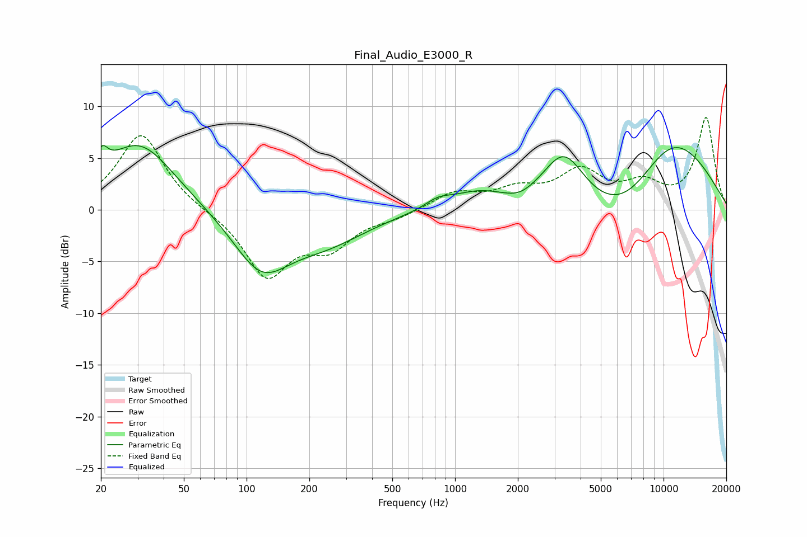

# Final_Audio_E3000_R
See [usage instructions](https://github.com/jaakkopasanen/AutoEq#usage) for more options and info.

### Parametric EQs
Apply preamp of -6.3 dB when using parametric equalizer.

|   # | Type    |   Fc (Hz) |    Q |   Gain (dB) |
|-----|---------|-----------|------|-------------|
|   1 | Peaking |        20 | 4.98 |         2   |
|   2 | Peaking |        30 | 0.83 |         6.5 |
|   3 | Peaking |       118 | 1.03 |        -5.5 |
|   4 | Peaking |       242 | 0.72 |        -2.6 |
|   5 | Peaking |       828 | 2.19 |         0.8 |
|   6 | Peaking |      1286 | 1.1  |         1.6 |
|   7 | Peaking |      2038 | 2.17 |        -0.6 |
|   8 | Peaking |      3323 | 1.35 |         5.6 |
|   9 | Peaking |      6773 | 0.56 |        -7   |
|  10 | Peaking |      9984 | 0.49 |        10.3 |

### Fixed Band EQs
When using fixed band (also called graphic) equalizer, apply preamp of **-9.0 dB** (if available) and set gains manually with these parameters.

|   # | Type    |   Fc (Hz) |    Q |   Gain (dB) |
|-----|---------|-----------|------|-------------|
|   1 | Peaking |        31 | 1.41 |         7.4 |
|   2 | Peaking |        62 | 1.41 |        -0.1 |
|   3 | Peaking |       125 | 1.41 |        -6.3 |
|   4 | Peaking |       250 | 1.41 |        -3.2 |
|   5 | Peaking |       500 | 1.41 |        -0.6 |
|   6 | Peaking |      1000 | 1.41 |         1.6 |
|   7 | Peaking |      2000 | 1.41 |         1.7 |
|   8 | Peaking |      4000 | 1.41 |         3.5 |
|   9 | Peaking |      8000 | 1.41 |         2.2 |
|  10 | Peaking |     16000 | 1.41 |         8.8 |

### Graphs

