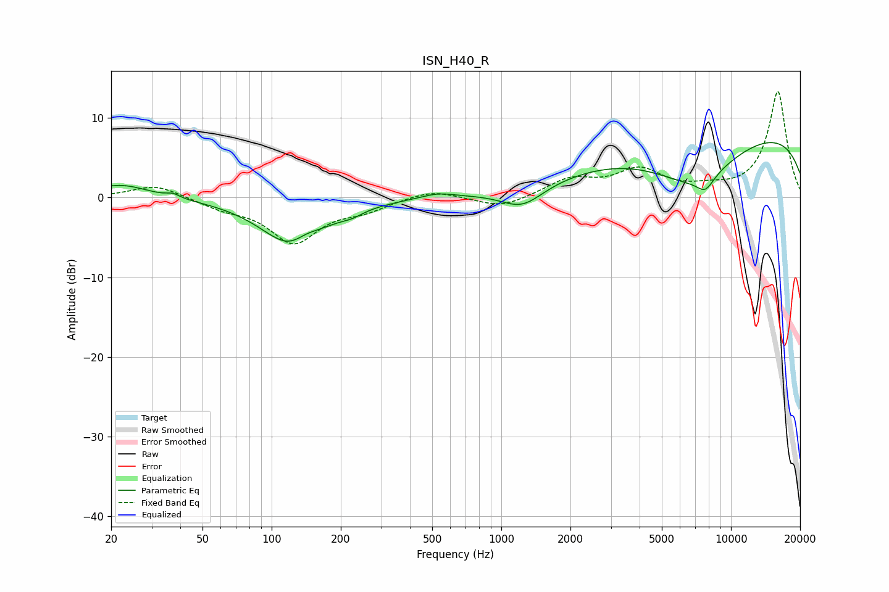

# ISN_H40_R
See [usage instructions](https://github.com/jaakkopasanen/AutoEq#usage) for more options and info.

### Parametric EQs
Apply preamp of -7.0 dB when using parametric equalizer.

|   # | Type    |   Fc (Hz) |    Q |   Gain (dB) |
|-----|---------|-----------|------|-------------|
|   1 | Peaking |        22 | 1.18 |         1.7 |
|   2 | Peaking |        37 | 5.17 |         0.5 |
|   3 | Peaking |       125 | 1.05 |        -6.4 |
|   4 | Peaking |       141 | 2.39 |         1.4 |
|   5 | Peaking |       224 | 2.97 |        -0.5 |
|   6 | Peaking |       528 | 2.01 |         0.6 |
|   7 | Peaking |      1234 | 1.5  |        -2.7 |
|   8 | Peaking |      6879 | 0.69 |        -6.1 |
|   9 | Peaking |      7741 | 3.47 |        -1.8 |
|  10 | Peaking |     10000 | 0.18 |         8.9 |

### Fixed Band EQs
When using fixed band (also called graphic) equalizer, apply preamp of **-13.4 dB** (if available) and set gains manually with these parameters.

|   # | Type    |   Fc (Hz) |    Q |   Gain (dB) |
|-----|---------|-----------|------|-------------|
|   1 | Peaking |        31 | 1.41 |         1.7 |
|   2 | Peaking |        62 | 1.41 |        -1.1 |
|   3 | Peaking |       125 | 1.41 |        -5.5 |
|   4 | Peaking |       250 | 1.41 |        -1.3 |
|   5 | Peaking |       500 | 1.41 |         1.1 |
|   6 | Peaking |      1000 | 1.41 |        -1.4 |
|   7 | Peaking |      2000 | 1.41 |         2.2 |
|   8 | Peaking |      4000 | 1.41 |         3.2 |
|   9 | Peaking |      8000 | 1.41 |         0.8 |
|  10 | Peaking |     16000 | 1.41 |        13.3 |

### Graphs

