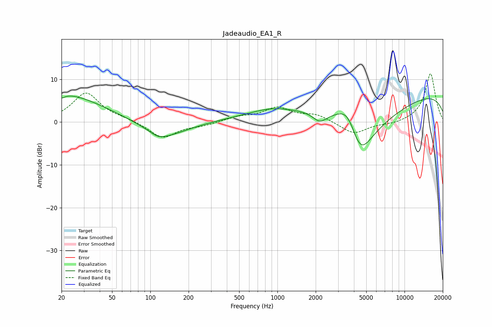

# Jadeaudio_EA1_R
See [usage instructions](https://github.com/jaakkopasanen/AutoEq#usage) for more options and info.

### Parametric EQs
Apply preamp of -6.2 dB when using parametric equalizer.

|   # | Type    |   Fc (Hz) |    Q |   Gain (dB) |
|-----|---------|-----------|------|-------------|
|   1 | Peaking |        20 | 5.4  |        -0.9 |
|   2 | Peaking |        20 | 0.44 |         6.7 |
|   3 | Peaking |       116 | 2.22 |        -1.1 |
|   4 | Peaking |       130 | 0.77 |        -3.4 |
|   5 | Peaking |       860 | 1.25 |         0.6 |
|   6 | Peaking |      1934 | 0.3  |         4.1 |
|   7 | Peaking |      2151 | 2.66 |        -2.2 |
|   8 | Peaking |      3618 | 1.45 |         8.2 |
|   9 | Peaking |      4421 | 0.82 |       -20   |
|  10 | Peaking |     10000 | 0.18 |         7.5 |

### Fixed Band EQs
When using fixed band (also called graphic) equalizer, apply preamp of **-11.4 dB** (if available) and set gains manually with these parameters.

|   # | Type    |   Fc (Hz) |    Q |   Gain (dB) |
|-----|---------|-----------|------|-------------|
|   1 | Peaking |        31 | 1.41 |         6.8 |
|   2 | Peaking |        62 | 1.41 |         0.6 |
|   3 | Peaking |       125 | 1.41 |        -3.8 |
|   4 | Peaking |       250 | 1.41 |        -0.7 |
|   5 | Peaking |       500 | 1.41 |         1.1 |
|   6 | Peaking |      1000 | 1.41 |         3.2 |
|   7 | Peaking |      2000 | 1.41 |         1.6 |
|   8 | Peaking |      4000 | 1.41 |        -2.9 |
|   9 | Peaking |      8000 | 1.41 |        -0.5 |
|  10 | Peaking |     16000 | 1.41 |        11.4 |

### Graphs

