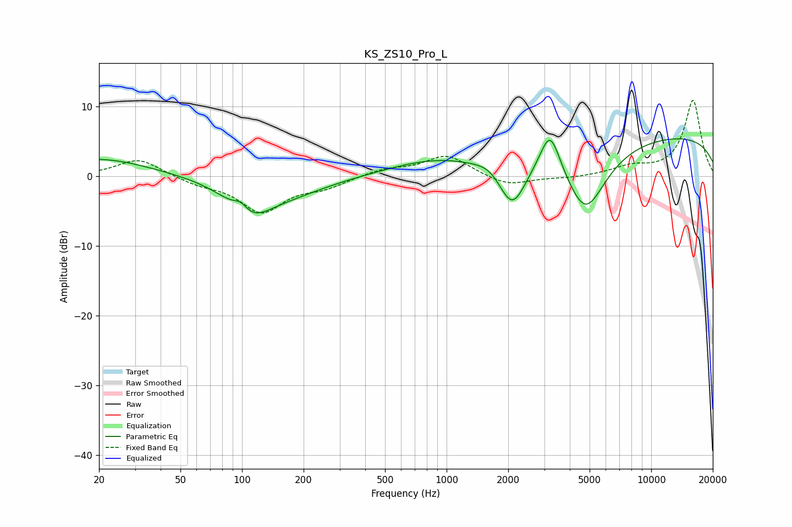

# KS_ZS10_Pro_L
See [usage instructions](https://github.com/jaakkopasanen/AutoEq#usage) for more options and info.

### Parametric EQs
Apply preamp of -5.4 dB when using parametric equalizer.

|   # | Type    |   Fc (Hz) |    Q |   Gain (dB) |
|-----|---------|-----------|------|-------------|
|   1 | Peaking |        20 | 0.59 |         2.6 |
|   2 | Peaking |        99 | 3.85 |         1.6 |
|   3 | Peaking |       108 | 1.33 |        -4.7 |
|   4 | Peaking |       169 | 0.71 |        -2.2 |
|   5 | Peaking |       865 | 0.62 |         2   |
|   6 | Peaking |      1636 | 2.35 |         1   |
|   7 | Peaking |      2091 | 2.03 |        -7   |
|   8 | Peaking |      3206 | 2.82 |         6.5 |
|   9 | Peaking |      4772 | 1.33 |       -10   |
|  10 | Peaking |     10000 | 0.18 |         6   |

### Fixed Band EQs
When using fixed band (also called graphic) equalizer, apply preamp of **-11.0 dB** (if available) and set gains manually with these parameters.

|   # | Type    |   Fc (Hz) |    Q |   Gain (dB) |
|-----|---------|-----------|------|-------------|
|   1 | Peaking |        31 | 1.41 |         2.6 |
|   2 | Peaking |        62 | 1.41 |        -1   |
|   3 | Peaking |       125 | 1.41 |        -5   |
|   4 | Peaking |       250 | 1.41 |        -1.4 |
|   5 | Peaking |       500 | 1.41 |         1   |
|   6 | Peaking |      1000 | 1.41 |         3   |
|   7 | Peaking |      2000 | 1.41 |        -1.5 |
|   8 | Peaking |      4000 | 1.41 |        -0.3 |
|   9 | Peaking |      8000 | 1.41 |         1.2 |
|  10 | Peaking |     16000 | 1.41 |        10.9 |

### Graphs

