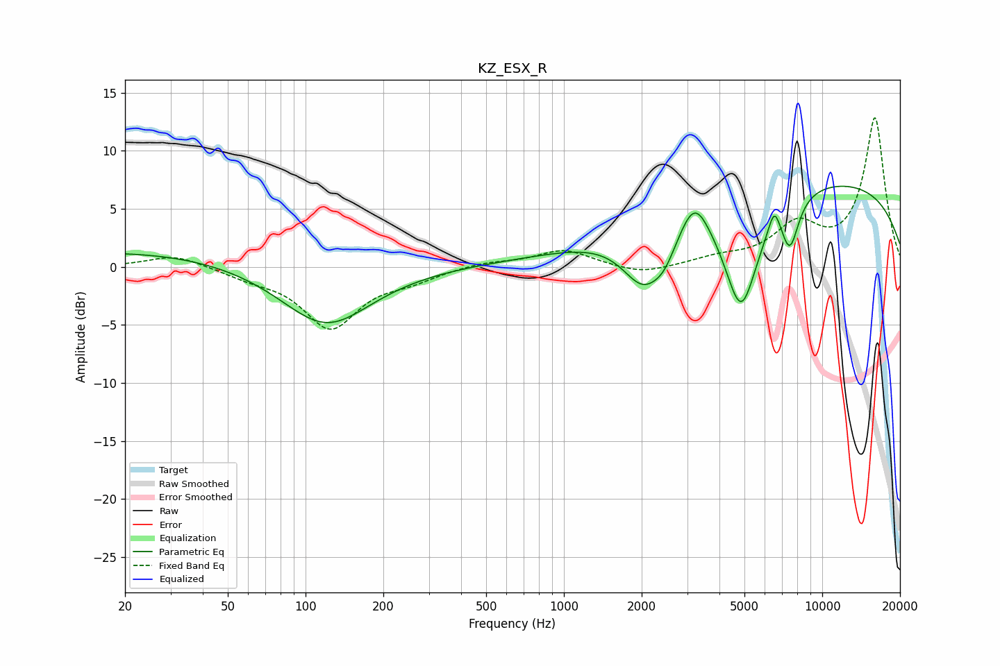

# KZ_ESX_R
See [usage instructions](https://github.com/jaakkopasanen/AutoEq#usage) for more options and info.

### Parametric EQs
Apply preamp of -7.0 dB when using parametric equalizer.

|   # | Type    |   Fc (Hz) |    Q |   Gain (dB) |
|-----|---------|-----------|------|-------------|
|   1 | Peaking |        22 | 0.32 |         1.4 |
|   2 | Peaking |       120 | 0.81 |        -5.2 |
|   3 | Peaking |      1451 | 0.25 |         0.3 |
|   4 | Peaking |      2043 | 1.62 |        -5.2 |
|   5 | Peaking |      2460 | 3.05 |        -1.6 |
|   6 | Peaking |      3204 | 2.64 |         2.9 |
|   7 | Peaking |      4852 | 1.98 |       -10.1 |
|   8 | Peaking |      6523 | 6    |         2.1 |
|   9 | Peaking |      7498 | 3.93 |        -4.1 |
|  10 | Peaking |      8645 | 0.19 |         7.7 |

### Fixed Band EQs
When using fixed band (also called graphic) equalizer, apply preamp of **-12.9 dB** (if available) and set gains manually with these parameters.

|   # | Type    |   Fc (Hz) |    Q |   Gain (dB) |
|-----|---------|-----------|------|-------------|
|   1 | Peaking |        31 | 1.41 |         1.1 |
|   2 | Peaking |        62 | 1.41 |        -0.7 |
|   3 | Peaking |       125 | 1.41 |        -5.1 |
|   4 | Peaking |       250 | 1.41 |        -0.9 |
|   5 | Peaking |       500 | 1.41 |         0.4 |
|   6 | Peaking |      1000 | 1.41 |         1.5 |
|   7 | Peaking |      2000 | 1.41 |        -0.7 |
|   8 | Peaking |      4000 | 1.41 |         0.6 |
|   9 | Peaking |      8000 | 1.41 |         3.3 |
|  10 | Peaking |     16000 | 1.41 |        12.8 |

### Graphs

