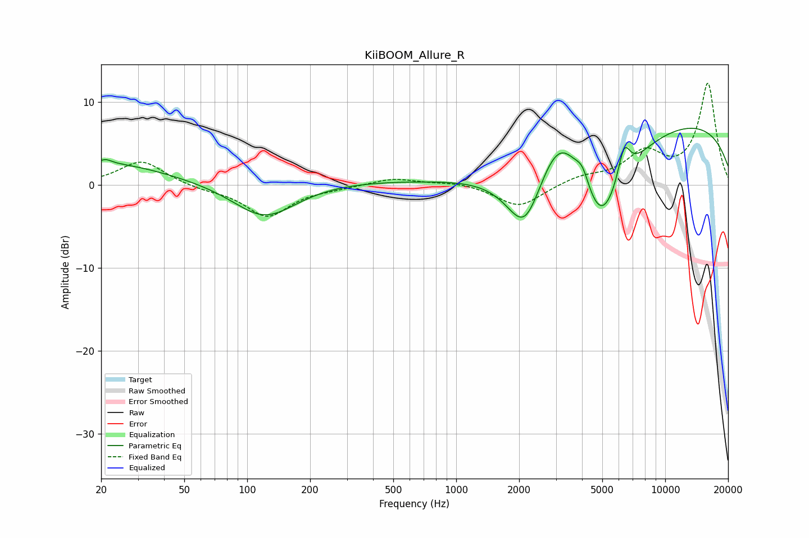

# KiiBOOM_Allure_R
See [usage instructions](https://github.com/jaakkopasanen/AutoEq#usage) for more options and info.

### Parametric EQs
Apply preamp of -6.9 dB when using parametric equalizer.

|   # | Type    |   Fc (Hz) |    Q |   Gain (dB) |
|-----|---------|-----------|------|-------------|
|   1 | Peaking |        21 | 0.51 |         2.6 |
|   2 | Peaking |        21 | 5.39 |         0.5 |
|   3 | Peaking |       121 | 0.91 |        -4.5 |
|   4 | Peaking |       188 | 0.27 |         0.7 |
|   5 | Peaking |      2134 | 1.52 |        -8.6 |
|   6 | Peaking |      3130 | 1.23 |         7.4 |
|   7 | Peaking |      4022 | 4.49 |         2   |
|   8 | Peaking |      4923 | 1.11 |       -12.3 |
|   9 | Peaking |      6354 | 4.58 |         4.2 |
|  10 | Peaking |      9901 | 0.21 |         8   |

### Fixed Band EQs
When using fixed band (also called graphic) equalizer, apply preamp of **-12.3 dB** (if available) and set gains manually with these parameters.

|   # | Type    |   Fc (Hz) |    Q |   Gain (dB) |
|-----|---------|-----------|------|-------------|
|   1 | Peaking |        31 | 1.41 |         3   |
|   2 | Peaking |        62 | 1.41 |        -0.5 |
|   3 | Peaking |       125 | 1.41 |        -3.8 |
|   4 | Peaking |       250 | 1.41 |        -0.3 |
|   5 | Peaking |       500 | 1.41 |         0.9 |
|   6 | Peaking |      1000 | 1.41 |         0.4 |
|   7 | Peaking |      2000 | 1.41 |        -2.7 |
|   8 | Peaking |      4000 | 1.41 |         0.9 |
|   9 | Peaking |      8000 | 1.41 |         3.6 |
|  10 | Peaking |     16000 | 1.41 |        12.2 |

### Graphs

