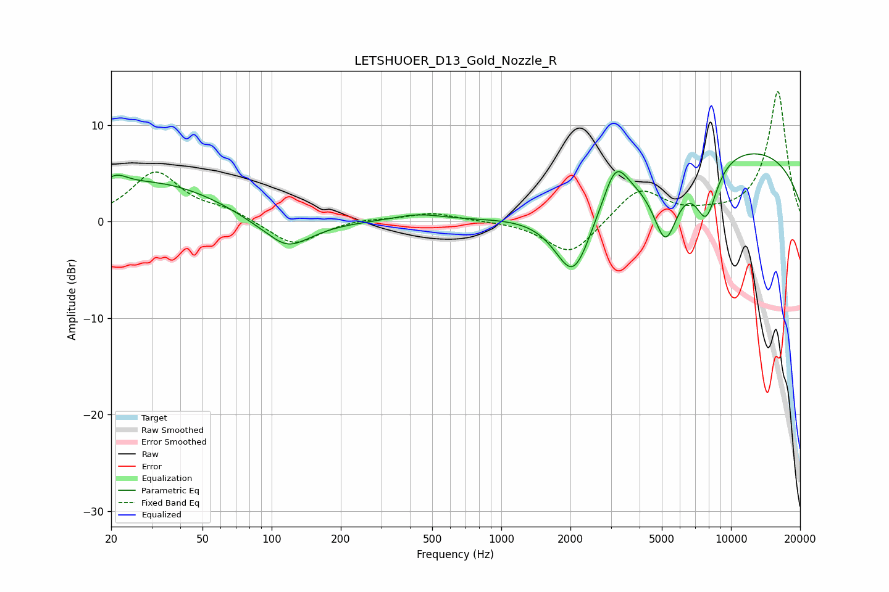

# LETSHUOER_D13_Gold_Nozzle_R
See [usage instructions](https://github.com/jaakkopasanen/AutoEq#usage) for more options and info.

### Parametric EQs
Apply preamp of -7.1 dB when using parametric equalizer.

|   # | Type    |   Fc (Hz) |    Q |   Gain (dB) |
|-----|---------|-----------|------|-------------|
|   1 | Peaking |        21 | 2.76 |         1.4 |
|   2 | Peaking |        31 | 0.47 |         4   |
|   3 | Peaking |       102 | 1.74 |         1.4 |
|   4 | Peaking |       110 | 1.28 |        -4.7 |
|   5 | Peaking |       433 | 1.29 |         0.7 |
|   6 | Peaking |      2062 | 1.68 |        -7.9 |
|   7 | Peaking |      3145 | 2.7  |         4   |
|   8 | Peaking |      5190 | 2.48 |        -7.3 |
|   9 | Peaking |      7801 | 2.71 |        -5.8 |
|  10 | Peaking |     10000 | 0.23 |         7.8 |

### Fixed Band EQs
When using fixed band (also called graphic) equalizer, apply preamp of **-13.6 dB** (if available) and set gains manually with these parameters.

|   # | Type    |   Fc (Hz) |    Q |   Gain (dB) |
|-----|---------|-----------|------|-------------|
|   1 | Peaking |        31 | 1.41 |         5   |
|   2 | Peaking |        62 | 1.41 |         1   |
|   3 | Peaking |       125 | 1.41 |        -2.6 |
|   4 | Peaking |       250 | 1.41 |         0.3 |
|   5 | Peaking |       500 | 1.41 |         0.9 |
|   6 | Peaking |      1000 | 1.41 |         0.1 |
|   7 | Peaking |      2000 | 1.41 |        -3.6 |
|   8 | Peaking |      4000 | 1.41 |         3.5 |
|   9 | Peaking |      8000 | 1.41 |         0.4 |
|  10 | Peaking |     16000 | 1.41 |        13.5 |

### Graphs

