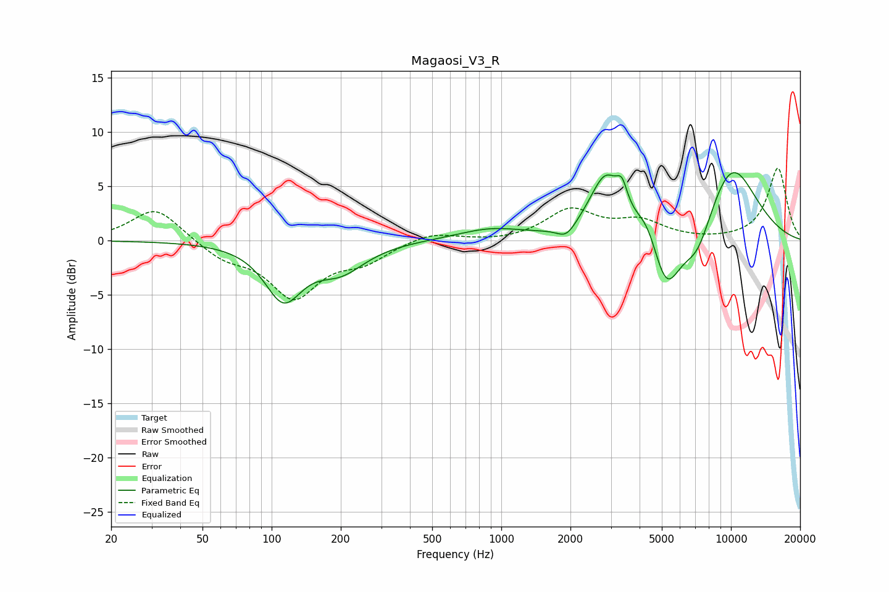

# Magaosi_V3_R
See [usage instructions](https://github.com/jaakkopasanen/AutoEq#usage) for more options and info.

### Parametric EQs
Apply preamp of -6.3 dB when using parametric equalizer.

|   # | Type    |   Fc (Hz) |    Q |   Gain (dB) |
|-----|---------|-----------|------|-------------|
|   1 | Peaking |       113 | 1.74 |        -5.1 |
|   2 | Peaking |       200 | 1.3  |        -2.5 |
|   3 | Peaking |       900 | 0.97 |         1   |
|   4 | Peaking |      1922 | 3.47 |        -1.2 |
|   5 | Peaking |      2842 | 2.01 |         5.6 |
|   6 | Peaking |      3354 | 5.99 |         2   |
|   7 | Peaking |      4322 | 2.59 |         2.2 |
|   8 | Peaking |      5217 | 2.16 |        -5.9 |
|   9 | Peaking |      7141 | 1.99 |        -3.5 |
|  10 | Peaking |     10000 | 0.99 |         7.2 |

### Fixed Band EQs
When using fixed band (also called graphic) equalizer, apply preamp of **-6.7 dB** (if available) and set gains manually with these parameters.

|   # | Type    |   Fc (Hz) |    Q |   Gain (dB) |
|-----|---------|-----------|------|-------------|
|   1 | Peaking |        31 | 1.41 |         3.1 |
|   2 | Peaking |        62 | 1.41 |        -1.5 |
|   3 | Peaking |       125 | 1.41 |        -5   |
|   4 | Peaking |       250 | 1.41 |        -1.6 |
|   5 | Peaking |       500 | 1.41 |         0.8 |
|   6 | Peaking |      1000 | 1.41 |        -0.2 |
|   7 | Peaking |      2000 | 1.41 |         2.7 |
|   8 | Peaking |      4000 | 1.41 |         1.6 |
|   9 | Peaking |      8000 | 1.41 |        -0.1 |
|  10 | Peaking |     16000 | 1.41 |         6.7 |

### Graphs

