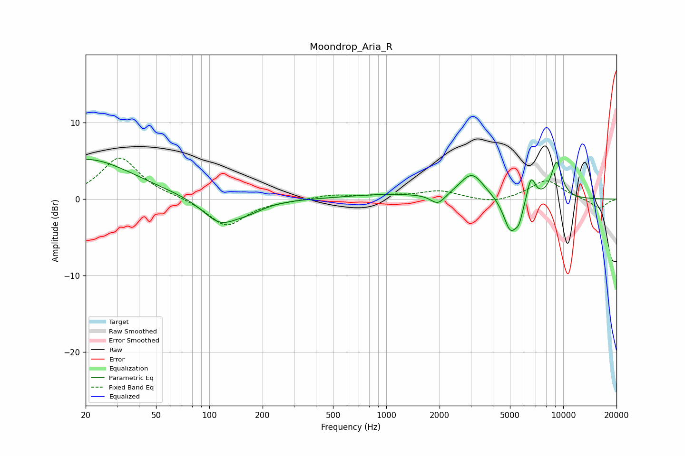

# Moondrop_Aria_R
See [usage instructions](https://github.com/jaakkopasanen/AutoEq#usage) for more options and info.

### Parametric EQs
Apply preamp of -5.3 dB when using parametric equalizer.

|   # | Type    |   Fc (Hz) |    Q |   Gain (dB) |
|-----|---------|-----------|------|-------------|
|   1 | Peaking |        20 | 0.53 |         5.3 |
|   2 | Peaking |       115 | 1.43 |        -3.2 |
|   3 | Peaking |       167 | 1.53 |        -1   |
|   4 | Peaking |      1032 | 0.58 |         0.6 |
|   5 | Peaking |      1959 | 3.5  |        -1.4 |
|   6 | Peaking |      3046 | 2.07 |         3.3 |
|   7 | Peaking |      5028 | 3.51 |        -4.4 |
|   8 | Peaking |      5637 | 5.93 |        -2   |
|   9 | Peaking |      6584 | 5.65 |         3   |
|  10 | Peaking |      9169 | 4.03 |         4.8 |

### Fixed Band EQs
When using fixed band (also called graphic) equalizer, apply preamp of **-5.5 dB** (if available) and set gains manually with these parameters.

|   # | Type    |   Fc (Hz) |    Q |   Gain (dB) |
|-----|---------|-----------|------|-------------|
|   1 | Peaking |        31 | 1.41 |         5.4 |
|   2 | Peaking |        62 | 1.41 |         0.2 |
|   3 | Peaking |       125 | 1.41 |        -3.6 |
|   4 | Peaking |       250 | 1.41 |        -0.1 |
|   5 | Peaking |       500 | 1.41 |         0.6 |
|   6 | Peaking |      1000 | 1.41 |         0.4 |
|   7 | Peaking |      2000 | 1.41 |         1   |
|   8 | Peaking |      4000 | 1.41 |        -0.6 |
|   9 | Peaking |      8000 | 1.41 |         2.5 |
|  10 | Peaking |     16000 | 1.41 |        -1.3 |

### Graphs

